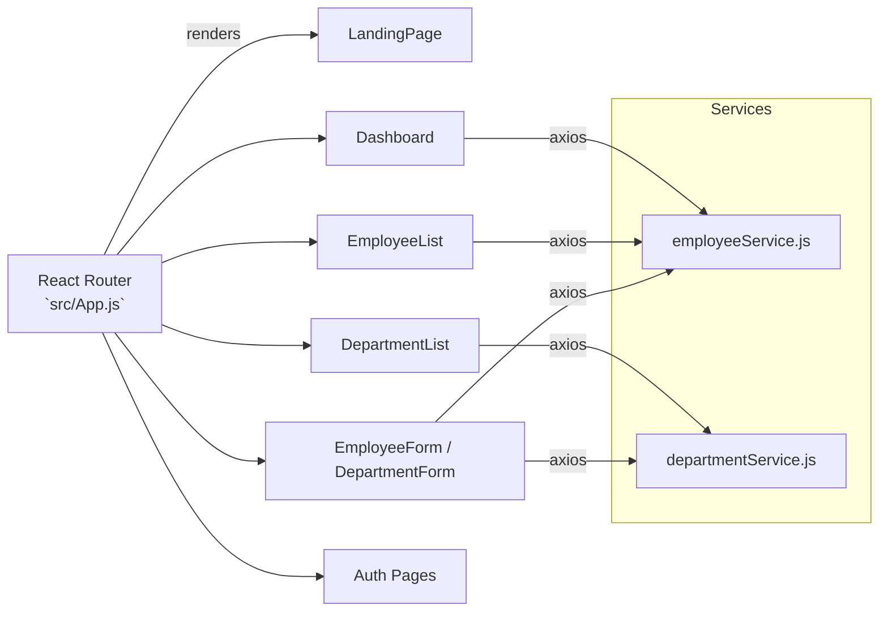
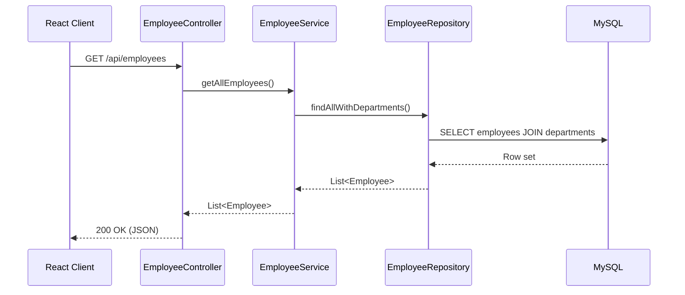
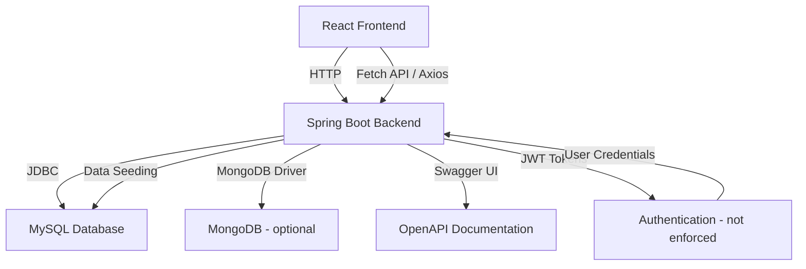
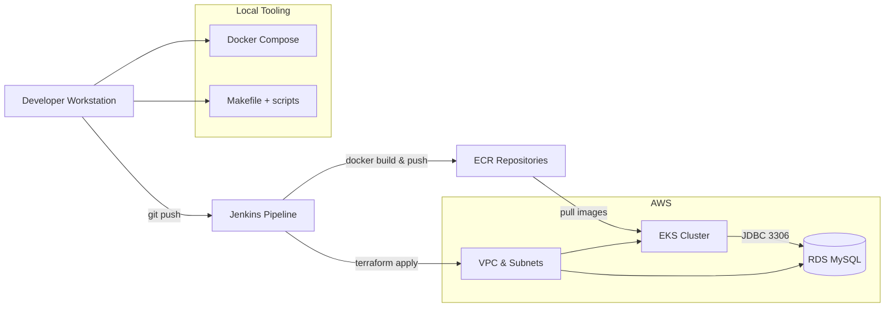
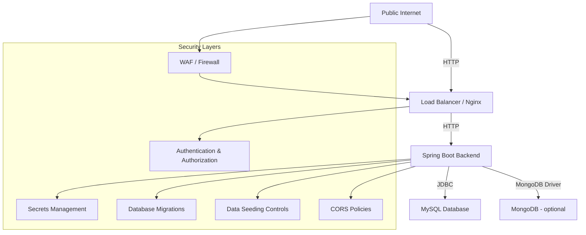

# Employee Management System Architecture

This document captures the current architecture of the Employee Management System so that contributors and operators can understand how the solution is structured today, which guarantees are already implemented, and where further hardening is required. The description below is based solely on the source code and infrastructure assets that live in this repository.

---

## 1. Solution Overview

- **Domain**: Manage employees and departments, including CRUD workflows, dashboard metrics, authentication stubs, and seeded demo data.
- **Stack**: React 18 SPA with Material UI and Chart.js on the frontend, Spring Boot 2.7 on Java 11 for the backend, MySQL as the primary datastore, optional MongoDB connectivity, and Docker/Kubernetes/Terraform for packaging and deployment.
- **Key Repos**: Frontend under `frontend/`, backend under `backend/`, infrastructure helpers under `docker-compose.yml`, `kubernetes/`, `terraform/`, and `scripts/`.

---

## 2. Frontend Architecture (`frontend/`)

### 2.1 Application shell

- Entry point `src/App.js` configures routing with React Router v6, wrapping pages in a Material UI `Container` and global `Navbar`/`Footer` components.
- The SPA renders multiple feature routes including dashboard visualizations, employee and department CRUD forms, authentication views (`Login`, `Register`, `ResetPassword`, `VerifyUsername`), and profile/404 pages.

### 2.2 Component breakdown

- Feature components live in `src/components/` and rely on React hooks for state management (`useState`, `useEffect`).
- `Dashboard.js` combines live API data with static samples to render Chart.js bar/line/pie charts for metrics such as employee count, age distribution, and growth trends.
- CRUD components (`EmployeeList.js`, `EmployeeForm.js`, `DepartmentList.js`, `DepartmentForm.js`, `NewDepartmentForm.js`) share a consistent pattern: fetch data on mount, expose form interactions, and invoke service helpers for persistence.
- Authentication-related components (`Login.js`, `Register.js`, `ResetPassword.js`, `VerifyUsername.js`) render forms but do not store tokens locally—the backend currently permits all requests (see §4.5).

### 2.3 Data access layer

- Network calls are centralized in `src/services/employeeService.js` and `src/services/departmentService.js`. Both modules use Axios and point to the Render-hosted backend (`https://employee-management-app-gdm5.onrender.com/...`).
- For local development the README instructs developers to override the base URL via `.env` (`REACT_APP_API_URL`), though conditional switching logic is not present in code—contributors must update the service files or provide proxy settings when pointing to a different backend.

### 2.4 Styling and UX

- Material UI drives the bulk of presentation, while Tailwind utility classes supplement styling in custom JSX.
- Chart.js (through `react-chartjs-2`) powers dashboard charts; `Chart.register(...)` is called within `Dashboard.js` to ensure the required controllers are available.
- Animations and loaders leverage Material UI components such as `CircularProgress`.

### 2.5 Testing

- Jest and React Testing Library are configured via `jest.config.js` and `jest.setup.js`. Component tests live in `frontend/__tests__/` (e.g., `Dashboard.spec.js`, `EmployeeList.test.js`, `Login.test.js`).
- The root `package.json` script `npm test` currently proxies to `cd frontend && npm start`, so running tests requires invoking `npm test` inside `frontend/` directly or wiring the script appropriately.

---

## 3. Backend Architecture (`backend/`)

### 3.1 Application entry

- `EmployeeManagementApplication.java` (Spring Boot) bootstraps the application.
- The project targets Java 11 (`pom.xml`) and integrates Spring Boot starters for web, data JPA, security, MongoDB, OpenAPI, and testing.

### 3.2 Domain model & persistence

- Entities (`model/`):
  - `Employee` links to `Department` via `@ManyToOne` with eager fetch.
  - `Department` maintains a `@OneToMany` collection of `Employee` instances with cascading deletes.
  - `User` represents authentication principals stored in a `users` table.
- Repositories (`repository/`):
  - `EmployeeRepository` extends `JpaRepository` and exposes `findAllWithDepartments()` using a `JOIN FETCH` query to avoid N+1 problems.
  - `DepartmentRepository` offers standard CRUD.
  - `UserRepository` enables lookup by username for authentication flows.
- Data initialization (`config/DataInitializer.java`) seeds 50 fake departments and 295 employees on startup using Java Faker. The initializer clears existing tables before inserting fresh demo data, which makes the demo deterministic but unsuitable for production without guards.

### 3.3 Service layer

- `EmployeeService` and `DepartmentService` wrap repository interactions to encapsulate CRUD logic. Both expose `getAll`, `getById`, `save`, and `delete` style methods.

### 3.4 API layer

- Controllers (`controller/`):
  - `EmployeeController` and `DepartmentController` expose RESTful CRUD endpoints under `/api/employees` and `/api/departments`. They apply `@CrossOrigin(origins = "http://localhost:3000")` and annotate operations with Swagger metadata (`@Operation`, `@ApiResponses`).
  - `AuthController` implements user registration, authentication (JWT issuance), username verification, and password reset endpoints. Responses return simple status messages or a `token` JSON payload.
  - `HomeController` serves a default view (used for Swagger UI landing).
- Exception handling uses `ResourceNotFoundException` annotated with `@ResponseStatus(HttpStatus.NOT_FOUND)`.
- Documentation: the project depends on `springdoc-openapi-ui` and exposes Swagger UI at `/swagger-ui.html`.

### 3.5 Configuration & environment

- `application.properties` imports an optional `config.properties` file, enabling secrets and connection strings to be defined outside version control. By default the application expects MySQL and MongoDB credentials through environment variables.
- `CorsConfig` registers a permissive CORS policy allowing any origin, headers, and credentials.
- `config.properties` in the repo contains sample managed service credentials. Treat these values as placeholders—they should be rotated before real deployments.

### 3.6 Security posture

- `SecurityConfig` extends `WebSecurityConfigurerAdapter`, wires `CustomUserDetailsService` with BCrypt password encoding, but ultimately disables CSRF and permits all requests (`http.csrf().disable().authorizeRequests().anyRequest().permitAll()`).
- JWT helpers (`JwtTokenUtil`, `JwtRequestFilter`) and `CustomUserDetailsService` are present; however `JwtRequestFilter` is not registered with the HTTP security chain, and no request paths are currently protected. The authentication endpoints can issue tokens, but downstream controllers do not enforce them yet.
- Password hashing uses Spring Security's BCrypt encoder before persisting to the `users` table.

### 3.7 Testing

- JPA-focused integration tests reside under `src/test/java/com/example/employeemanagement/`, covering repository CRUD operations and data integrity (`BackendAPITests`, `AdditionalAPITests`, etc.). Tests rely on H2 (via Spring Boot test dependencies) and validate typical workflows like saving, retrieving, and deleting employees and departments.

### 3.8 Observability & logging

- JPA SQL logging is enabled via `spring.jpa.show-sql=true`. No additional logging, tracing, or metrics providers are configured yet.

---

## 4. Data & Integrations

- **Primary datastore**: MySQL (`employees`, `departments`, `users`). Hibernate `ddl-auto=update` evolves the schema at runtime, which is convenient for demos but risky for production.
- **Secondary datastore**: MongoDB connection string is configurable (`spring.data.mongodb.uri`) but no repository currently consumes it. Future Mongo use would require additional Spring Data Mongo repositories.
- **Seed data**: `DataInitializer` recreates data on every application start (see §3.2). Remove or guard this behavior before deploying to persistent environments.
- **OpenAPI contract**: `openapi.yaml` at the repo root enumerates the REST API and aligns with the annotated controllers.

---

## 5. DevOps, Delivery & Runtime Options

### 5.1 Local orchestration

- `docker-compose.yml` spins up MySQL, MongoDB, the Spring Boot backend, and a React build served through Nginx. Health checks are configured for the backend (`/actuator/health`), MySQL, and Mongo.
- The root `Makefile` provides automation targets for building and running backend/frontend code, generating Docker images, managing Kubernetes manifests, and generating OpenAPI clients.
- Helper scripts in `scripts/` (e.g., `build-images.sh`, `deploy-k8s.sh`, `test-backend.sh`) encapsulate common workflows.

### 5.2 Kubernetes manifests

- `kubernetes/` contains raw manifests for backend/frontend deployments and services plus a config map. The manifests currently mount code via `hostPath` volumes and expose container ports `3000`/`3001`; align these values with the Spring Boot (`8080`) and React build (`80`) ports before production use.

### 5.3 Terraform stack

- `terraform/` defines a modular AWS deployment comprising VPC networking, an EKS cluster, managed node groups, an RDS MySQL instance, and ECR repositories. Modules use `terraform-aws-modules/*` under the hood and output cluster credentials and repository URLs.

### 5.4 CI/CD

- The repository includes a simple Jenkins pipeline (`Jenkinsfile`) that installs frontend dependencies (`npm install`) and builds the React bundle (`npm run build`). Additional stages (tests, Docker builds, deployments) can be added as the stack matures.

### 5.5 Ancillary assets

- `nginx/` holds a Dockerfile and configuration intended for load balancing. The current config proxies to `moodify-emotion-music-app.onrender.com`, indicating it is a placeholder that must be replaced with the Employee Management services before reuse.
- Image assets for documentation are stored under `img/` and referenced by `README.md`.

---

## 6. Security & Compliance Considerations

- **Authentication & authorization**: Although JWT utilities exist, all endpoints are effectively public. Hardening requires registering `JwtRequestFilter`, protecting controller methods with `@PreAuthorize` or request matchers, and storing secrets securely.
- **Secrets management**: Replace the checked-in credentials in `backend/config.properties` with environment-specific secrets (AWS Secrets Manager, SSM Parameter Store, or Kubernetes Secrets) before production deployment.
- **Database migrations**: Switching from Hibernate `ddl-auto=update` to an explicit migration tool (Flyway/Liquibase) is recommended to control schema evolution.
- **Data seeding**: Disable `DataInitializer` outside of sandbox environments.
- **CORS**: Current configuration allows all origins and credentials. Introduce an allowlist when hosting in production.

---

## 7. Reference Map

| Capability | Primary Location |
|------------|------------------|
| React SPA | `frontend/src` |
| API controllers | `backend/src/main/java/com/example/employeemanagement/controller` |
| Services | `backend/src/main/java/com/example/employeemanagement/service` |
| Repositories | `backend/src/main/java/com/example/employeemanagement/repository` |
| Entities | `backend/src/main/java/com/example/employeemanagement/model` |
| Security configuration | `backend/src/main/java/com/example/employeemanagement/security` |
| Data seeding | `backend/src/main/java/com/example/employeemanagement/config/DataInitializer.java` |
| Docker Compose | `docker-compose.yml` |
| Kubernetes manifests | `kubernetes/` |
| Terraform AWS stack | `terraform/` |
| Scripts & automation | `scripts/` and `Makefile` |

---

**Document version**: 2024-06-10
**Author**: Son Nguyen
**Version**: 1.0.0
