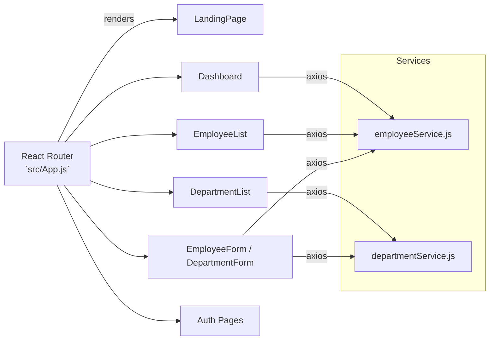
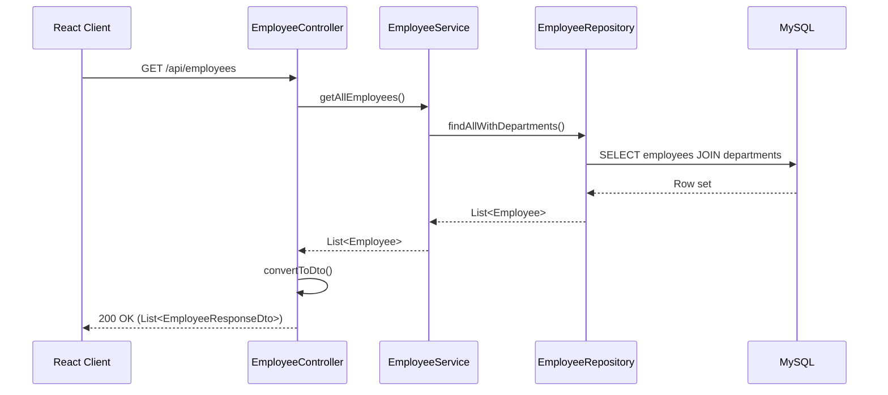
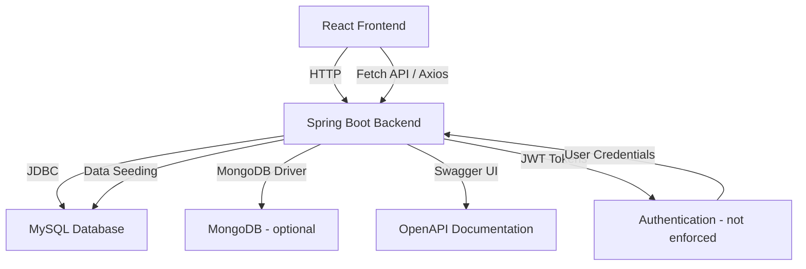
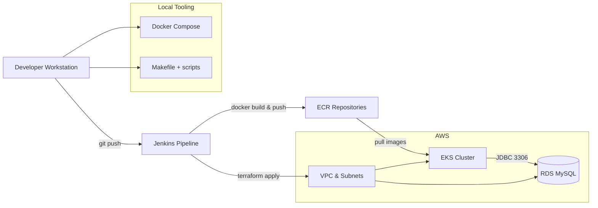
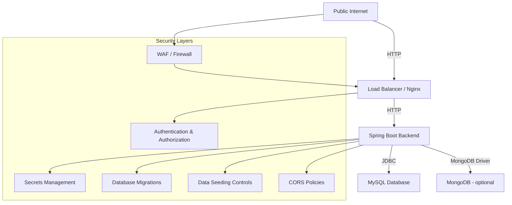

# Employee Management System Architecture

This document captures the current architecture of the Employee Management System so that contributors and operators can understand how the solution is structured today, which guarantees are already implemented, and where further hardening is required. The description below is based solely on the source code and infrastructure assets that live in this repository.

---

## 1. Solution Overview

- **Domain**: Manage employees and departments, including CRUD workflows, dashboard metrics, authentication stubs, and seeded demo data.
- **Stack**: React 18 SPA with Material UI and Chart.js on the frontend, Spring Boot 2.7 on Java 11 for the backend, MySQL as the primary datastore, optional MongoDB connectivity, and Docker/Kubernetes/Terraform for packaging and deployment.
- **Key Repos**: Frontend under `frontend/`, backend under `backend/`, infrastructure helpers under `docker-compose.yml`, `kubernetes/`, `terraform/`, and `scripts/`.

---

## 2. Frontend Architecture (`frontend/`)

### 2.1 Application shell

- Entry point `src/App.js` configures routing with React Router v6, wrapping pages in a Material UI `Container` and global `Navbar`/`Footer` components.
- The SPA renders multiple feature routes including dashboard visualizations, employee and department CRUD forms, authentication views (`Login`, `Register`, `ResetPassword`, `VerifyUsername`), and profile/404 pages.

### 2.2 Component breakdown

- Feature components live in `src/components/` and rely on React hooks for state management (`useState`, `useEffect`).
- `Dashboard.js` combines live API data with static samples to render Chart.js bar/line/pie charts for metrics such as employee count, age distribution, and growth trends.
- CRUD components (`EmployeeList.js`, `EmployeeForm.js`, `DepartmentList.js`, `DepartmentForm.js`, `NewDepartmentForm.js`) share a consistent pattern: fetch data on mount, expose form interactions, and invoke service helpers for persistence.
- Authentication-related components (`Login.js`, `Register.js`, `ResetPassword.js`, `VerifyUsername.js`) render forms and persist the JWT via `authService`. `Login.js` also offers "Sign in with a passkey", and `Register.js` auto-signs-in after sign-up then shows a passkey-setup modal.
- Passkey components: `Passkeys.js` (the `/passkeys` management page — add/rename/delete) and `PasskeyPromptDialog.js` (the post-sign-up modal). The `Navbar` exposes them via an **Account** dropdown (Passkeys + Log Out).

```mermaid
flowchart LR
    Router[React Router
    `src/App.js`] -->|renders| Landing[LandingPage]
    Router --> Dashboard
    Router --> Employees[EmployeeList]
    Router --> Departments[DepartmentList]
    Router --> Forms[EmployeeForm / DepartmentForm]
    Router --> Auth[Auth Pages]

    subgraph Services
        EmpSvc[employeeService.js]
        DeptSvc[departmentService.js]
    end

    Dashboard -->|axios| EmpSvc
    Employees -->|axios| EmpSvc
    Departments -->|axios| DeptSvc
    Forms -->|axios| EmpSvc
    Forms -->|axios| DeptSvc
```

### 2.3 Data access layer

- Network calls are centralized in `src/services/employeeService.js`, `src/services/departmentService.js`, and `src/services/passkeyService.js`. They use Axios and point to the Render-hosted backend (`https://employee-management-app-gdm5.onrender.com/...`); `passkeyService.js` honours an optional `REACT_APP_API_BASE_URL` override and attaches the JWT to management calls. `src/utils/webauthn.js` provides base64url ⇆ ArrayBuffer conversion and the `navigator.credentials` ceremony drivers.
- For local development the README instructs developers to override the base URL via `.env` (`REACT_APP_API_URL`), though conditional switching logic is not present in code—contributors must update the service files or provide proxy settings when pointing to a different backend.

### 2.4 Styling and UX

- Material UI drives the bulk of presentation, while Tailwind utility classes supplement styling in custom JSX.
- Chart.js (through `react-chartjs-2`) powers dashboard charts; `Chart.register(...)` is called within `Dashboard.js` to ensure the required controllers are available.
- Animations and loaders leverage Material UI components such as `CircularProgress`.
- Landing page is fully polished with 3D components and stylings with Three.js and React Three Fiber + WebGL for an immersive 3D experience.

### 2.5 Testing

- Jest and React Testing Library are configured via `jest.config.js` and `jest.setup.js`. Component tests live in `frontend/__tests__/` (e.g., `Dashboard.spec.js`, `EmployeeList.test.js`, `Login.test.js`).
- The root `package.json` script `npm test` currently proxies to `cd frontend && npm start`, so running tests requires invoking `npm test` inside `frontend/` directly or wiring the script appropriately.

---

## 3. Backend Architecture (`backend/`)

### 3.1 Application entry

- `EmployeeManagementApplication.java` (Spring Boot) bootstraps the application.
- The project targets Java 11 (`pom.xml`) and integrates Spring Boot starters for web, data JPA, security, MongoDB, OpenAPI, and testing.

### 3.2 Domain model & persistence

- Entities (`model/`):
  - `Employee` links to `Department` via `@ManyToOne` with eager fetch. Fields are validated with Bean Validation annotations (`@NotBlank`, `@Email`, `@Min`, `@Max`, `@NotNull`).
  - `Department` maintains a `@OneToMany` collection of `Employee` instances with `CascadeType.PERSIST` and `CascadeType.MERGE` (no cascade delete — departments with employees cannot be deleted).
  - `User` represents authentication principals stored in a `users` table. Each user also has a stable, opaque `userHandle` used by passkeys in place of the username.
  - `WebAuthnCredential` represents a registered passkey stored in `webauthn_credentials` (credential id, COSE public key, signature counter, transports, AAGUID, backup flags, timestamps) with a `@ManyToOne` link to `User`.
- Repositories (`repository/`):
  - `EmployeeRepository` extends `JpaRepository` and exposes `findAllWithDepartments()` and `findByIdWithDepartment()` using `LEFT JOIN FETCH` queries to avoid N+1 problems and ensure department data is always available. Also provides `countByDepartmentId()` for safe pre-delete checks.
  - `DepartmentRepository` offers standard CRUD.
  - `UserRepository` enables lookup by username (and `userHandle`) for authentication flows.
  - `WebAuthnCredentialRepository` looks up passkeys by owner and by credential id.
- Data initialization (`config/DataInitializer.java`) seeds 50 fake departments and 295 employees on first startup using Java Faker. The initializer checks `departmentRepository.count()` and skips seeding if data already exists, making it safe for production restarts.

### 3.3 DTO layer (`dto/`)

The API uses a dedicated DTO (Data Transfer Object) layer to decouple internal JPA entities from the API contract:

- **Request DTOs** — define the shape and validation rules for incoming requests:
  - `EmployeeRequestDto`: validated fields (`firstName`, `lastName`, `email`, `age`, `department.id`)
  - `DepartmentRequestDto`: validated `name` field
  - `AuthRequestDto`: validated `username` and `password` for login/register
  - `ResetPasswordRequestDto`: validated `username` and `newPassword`
  - Passkey DTOs: `PasskeyRegistrationFinishRequest`, `PasskeyAuthenticationStartRequest`, `PasskeyAuthenticationFinishRequest`, `PasskeyRenameRequest`
- **Response DTOs** — define the shape of API responses, preventing entity internals from leaking:
  - `EmployeeResponseDto`: includes a nested `department` object with `id` and `name` (avoids circular serialization issues between Employee and Department entities)
  - `DepartmentResponseDto`: returns `id`, `name`, and `employeeCount` (integer) instead of serializing the full employee list
  - `PasskeyDto` (safe passkey summary — never exposes key material) and `PasskeyCeremonyStartResponse` (flow id + browser-ready options)

Controllers convert between entities and DTOs using private `convertToDto()` and `convertToEntity()` methods.

### 3.4 Service layer

- `EmployeeService` wraps repository interactions and uses `@Transactional` with `EntityManager.flush()` and `EntityManager.refresh()` on save operations to ensure the returned entity has fully-loaded associations (e.g., department name after save).
- `DepartmentService` wraps repository CRUD and exposes `countEmployeesInDepartment()` for safe pre-delete validation.
- Passkeys (`webauthn/`): `PasskeyService` orchestrates WebAuthn registration and assertion ceremonies via the Yubico `java-webauthn-server` `RelyingParty`. Supporting types: `WebAuthnConfig` + `WebAuthnProperties` (build the relying party), `JpaCredentialRepository` (adapts stored credentials to Yubico's `CredentialRepository`), `WebAuthnCeremonyStore` (single-use, TTL-bound, in-memory challenge state), `UserHandles` (shared handle generation), `PasskeyException` (HTTP-status-aware errors).

### 3.5 API layer

- Controllers (`controller/`):
  - `EmployeeController` accepts `EmployeeRequestDto` for create/update and returns `EmployeeResponseDto`. It validates input via `@Valid`, resolves the department reference from the request DTO, and converts entities to DTOs before responding.
  - `DepartmentController` accepts `DepartmentRequestDto` for create/update and returns `DepartmentResponseDto` (with `employeeCount`). Department deletion is rejected with 409 Conflict if the department still has employees.
  - `AuthController` accepts `AuthRequestDto` for registration and authentication, `ResetPasswordRequestDto` for password resets. All inputs are validated with Bean Validation. The controller never exposes the `User` entity directly. Registration also assigns the user's WebAuthn `userHandle`.
  - `PasskeyController` (`/api/passkeys/**`) drives passkey registration/login ceremonies (start + finish) and credential management (list/rename/delete); a successful passkey login issues a JWT just like password login.
  - `HomeController` serves a default view (used for Swagger UI landing).
- Exception handling (`exception/`):
  - `GlobalExceptionHandler` (`@RestControllerAdvice`) handles `MethodArgumentNotValidException` (400), `ResourceNotFoundException` (404), `DataIntegrityViolationException` (400), `HttpMessageNotReadableException` (400), `AccessDeniedException` (403), `AuthenticationException` (401), and a generic `Exception` fallback (500). No stack traces are leaked to clients.
  - `ResourceNotFoundException` is a custom runtime exception.
- Documentation: the project depends on `springdoc-openapi-ui` and exposes Swagger UI at `/swagger-ui.html`.

```mermaid
sequenceDiagram
    participant UI as React Client
    participant Ctrl as EmployeeController
    participant Svc as EmployeeService
    participant Repo as EmployeeRepository
    participant DB as MySQL

    UI->>Ctrl: GET /api/employees
    Ctrl->>Svc: getAllEmployees()
    Svc->>Repo: findAllWithDepartments()
    Repo->>DB: SELECT employees JOIN departments
    DB-->>Repo: Row set
    Repo-->>Svc: List<Employee>
    Svc-->>Ctrl: List<Employee>
    Ctrl->>Ctrl: convertToDto()
    Ctrl-->>UI: 200 OK (List<EmployeeResponseDto>)
```

### 3.5 Configuration & environment

- `application.properties` imports an optional `config.properties` file, enabling secrets and connection strings to be defined outside version control. By default the application expects MySQL and MongoDB credentials through environment variables.
- `CorsConfig` registers a permissive CORS policy allowing any origin, headers, credentials, and the `GET/POST/PUT/PATCH/DELETE/OPTIONS` methods.
- WebAuthn relying-party settings are externalised under `webauthn.*` (`WEBAUTHN_RP_ID`, `WEBAUTHN_RP_NAME`, `WEBAUTHN_ALLOWED_ORIGINS`, plus optional `WEBAUTHN_ALLOW_ORIGIN_PORT` / `WEBAUTHN_CEREMONY_TIMEOUT_SECONDS`).
- `config.properties` in the repo contains sample managed service credentials. Treat these values as placeholders—they should be rotated before real deployments.

### 3.6 Security posture

- `SecurityConfig` extends `WebSecurityConfigurerAdapter`, wires `CustomUserDetailsService` with BCrypt encoding, disables CSRF, and uses stateless sessions. It registers `JwtRequestFilter` in the chain and secures the passkey-management routes (`/api/passkeys/register/**` and the list/rename/delete operations) behind a valid JWT; passkey login (`/api/passkeys/authenticate/**`) and all pre-existing routes remain public, preserving current behaviour. Unauthenticated access to a protected route returns a JSON `401`.
- JWT helpers (`JwtTokenUtil`, `JwtRequestFilter`) and `CustomUserDetailsService` drive token auth. `JwtTokenUtil` reads the signing secret from `${JWT_SECRET}` (no hardcoded fallback). `JwtRequestFilter` parses `Authorization: Bearer` headers, handles invalid/expired tokens gracefully, and is registered once inside the Spring Security chain (its servlet auto-registration is disabled). A successful passkey login also issues a JWT.
- **Passkeys / WebAuthn** add phishing-resistant, passwordless auth: only public-key material is stored, challenges are single-use and short-lived, and the relying party validates origin/RP-ID and the signature counter on every assertion.
- Password hashing uses Spring Security's BCrypt encoder before persisting to the `users` table.
- Input validation: all request DTOs use Bean Validation (`@NotBlank`, `@Email`, `@Min`, `@Max`, `@NotNull`) enforced at the controller layer via `@Valid`.

### 3.7 Testing

- JPA-focused integration tests reside under `src/test/java/com/example/employeemanagement/`, covering repository CRUD operations and data integrity (`BackendAPITests`, `AdditionalAPITests`, etc.). Tests rely on H2 (via Spring Boot test dependencies) and validate typical workflows like saving, retrieving, and deleting employees and departments.

### 3.8 Observability & logging

- JPA SQL logging is enabled via `spring.jpa.show-sql=true`. No additional logging, tracing, or metrics providers are configured yet.

---

## 4. Data & Integrations

- **Primary datastore**: MySQL (`employees`, `departments`, `users`). Hibernate `ddl-auto=update` evolves the schema at runtime, which is convenient for demos but risky for production.
- **Schema artifacts**: The repo now includes a root [data.sql](data.sql) all-in-one bootstrap plus split MySQL setup scripts under [backend/sql](backend/sql/README.md) for database creation, table DDL, and optional performance indexing.
- **Secondary datastore**: MongoDB connection string is configurable (`spring.data.mongodb.uri`) but no repository currently consumes it. Future Mongo use would require additional Spring Data Mongo repositories.
- **Seed data**: `DataInitializer` recreates data on every application start (see §3.2). Remove or guard this behavior before deploying to persistent environments.
- **OpenAPI contract**: `openapi.yaml` at the repo root enumerates the REST API and aligns with the annotated controllers.

Bootstrap behavior:

- If `MYSQL_DB` points to an existing blank database, Hibernate can create the missing tables on startup.
- If `MYSQL_DB` points to a nonexistent database, the backend will not create that database automatically.
- The schema creates `users`, but application startup only seeds `departments` and `employees`.

```mermaid
graph TD
    A[React Frontend] -->|HTTP| B[Spring Boot Backend]
    B -->|JDBC| C[MySQL Database]
    B -->|MongoDB Driver| D[MongoDB - optional]
    A -->|Fetch API / Axios| B
    B -->|Swagger UI| E[OpenAPI Documentation]
    B -->|JWT Tokens| F[Authentication - not enforced]
    F -->|User Credentials| B
    B -->|Data Seeding| C
```

---

## 5. DevOps, Delivery & Runtime Options

### 5.1 Local orchestration

- `docker-compose.yml` spins up MySQL, MongoDB, the Spring Boot backend, and a React build served through Nginx. Health checks are configured for the backend (`/actuator/health`), MySQL, and Mongo.
- The root `Makefile` provides automation targets for building and running backend/frontend code, generating Docker images, managing Kubernetes manifests, and generating OpenAPI clients.
- Helper scripts in `scripts/` (e.g., `build-images.sh`, `deploy-k8s.sh`, `test-backend.sh`) encapsulate common workflows.

### 5.2 Kubernetes manifests

- `kubernetes/` contains raw manifests for backend/frontend deployments and services plus a config map. The manifests currently mount code via `hostPath` volumes and expose container ports `3000`/`3001`; align these values with the Spring Boot (`8080`) and React build (`80`) ports before production use.

### 5.3 Terraform stack

- `terraform/` defines a modular AWS deployment comprising VPC networking, an EKS cluster, managed node groups, an RDS MySQL instance, and ECR repositories. Modules use `terraform-aws-modules/*` under the hood and output cluster credentials and repository URLs.

```mermaid
flowchart LR
    DevEnv[Developer Workstation]
    Jenkins[Jenkins Pipeline]
    ECR[ECR Repositories]
    EKS[EKS Cluster]
    RDS[(RDS MySQL)]

    DevEnv -->|git push| Jenkins
    Jenkins -->|docker build & push| ECR
    ECR -->|pull images| EKS
    EKS -->|JDBC 3306| RDS

    subgraph Local Tooling
        Compose[Docker Compose]
        Scripts[Makefile + scripts]
    end
    DevEnv --> Compose
    DevEnv --> Scripts

    subgraph AWS
        VPC[VPC & Subnets]
        VPC --> EKS
        VPC --> RDS
    end
    Jenkins -->|terraform apply| VPC
```

### 5.4 CI/CD

- The repository includes a simple Jenkins pipeline (`Jenkinsfile`) that installs frontend dependencies (`npm install`) and builds the React bundle (`npm run build`). Additional stages (tests, Docker builds, deployments) can be added as the stack matures.

### 5.5 Ancillary assets

- `nginx/` holds a Dockerfile and configuration intended for load balancing. The current config proxies to `moodify-emotion-music-app.onrender.com`, indicating it is a placeholder that must be replaced with the Employee Management services before reuse.
- Image assets for documentation are stored under `img/` and referenced by `README.md`.

---

## 6. Security & Compliance Considerations

- **Authentication & authorization**: `JwtRequestFilter` is registered in the Spring Security chain. Passkey-management routes require a valid JWT; passkey login and the pre-existing employee/department endpoints remain public by design. Further hardening (protecting the employee/department endpoints with request matchers or `@PreAuthorize`) is still recommended for production.
- **Passkeys (WebAuthn/FIDO2)**: phishing-resistant, passwordless sign-in. Only public keys are stored; challenges are single-use with a short TTL; the relying party validates origin/RP-ID and the signature counter. Configure `WEBAUTHN_RP_ID` / `WEBAUTHN_ALLOWED_ORIGINS` per environment (must match the frontend's HTTPS origin; localhost is exempt from the HTTPS requirement).
- **Secrets management**: Replace the checked-in credentials in `backend/config.properties` with environment-specific secrets (AWS Secrets Manager, SSM Parameter Store, or Kubernetes Secrets) before production deployment. The JWT signing secret must be provided via the `JWT_SECRET` environment variable — the application will fail to start without it.
- **Database migrations**: Switching from Hibernate `ddl-auto=update` to an explicit migration tool (Flyway/Liquibase) is recommended to control schema evolution.
- **Data seeding**: `DataInitializer` is now idempotent — it only seeds when the database is empty. Safe for production restarts.
- **CORS**: Current configuration allows all origins and credentials. Introduce an allowlist when hosting in production.

```mermaid
flowchart TD
    A[Public Internet] -->|HTTP| B[Load Balancer / Nginx]
    B -->|HTTP| C[Spring Boot Backend]
    C -->|JDBC| D[MySQL Database]
    C -->|MongoDB Driver| E[MongoDB - optional]

    subgraph Security Layers
        F[WAF / Firewall]
        G[Authentication & Authorization]
        H[Secrets Management]
        I[Database Migrations]
        J[Data Seeding Controls]
        K[CORS Policies]
    end

    A --> F
    F --> B
    B --> G
    C --> H
    C --> I
    C --> J
    C --> K
```

---

## 7. Reference Map

| Capability | Primary Location |
|------------|------------------|
| React SPA | `frontend/src` |
| API controllers | `backend/src/main/java/com/example/employeemanagement/controller` |
| DTOs (request/response) | `backend/src/main/java/com/example/employeemanagement/dto` |
| Services | `backend/src/main/java/com/example/employeemanagement/service` |
| Repositories | `backend/src/main/java/com/example/employeemanagement/repository` |
| Entities | `backend/src/main/java/com/example/employeemanagement/model` |
| Exception handling | `backend/src/main/java/com/example/employeemanagement/exception` |
| Security configuration | `backend/src/main/java/com/example/employeemanagement/security` |
| Passkeys / WebAuthn | `backend/.../webauthn`, `controller/PasskeyController.java`, `frontend/src/services/passkeyService.js`, `frontend/src/utils/webauthn.js`, `frontend/src/components/Passkeys.js` |
| Data seeding | `backend/src/main/java/com/example/employeemanagement/config/DataInitializer.java` |
| Root SQL bootstrap | `data.sql` |
| Split SQL bootstrap | `backend/sql/` |
| Docker Compose | `docker-compose.yml` |
| Kubernetes manifests | `kubernetes/` |
| Terraform AWS stack | `terraform/` |
| Scripts & automation | `scripts/` and `Makefile` |

---

**Document version**: 2026-03-27
**Author**: Son Nguyen
**Version**: 2.0.0
