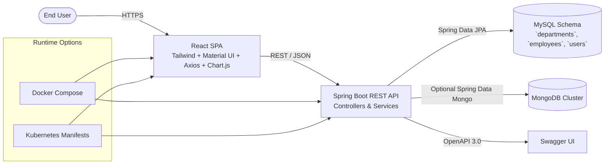
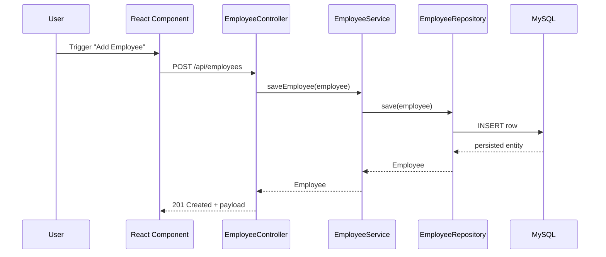
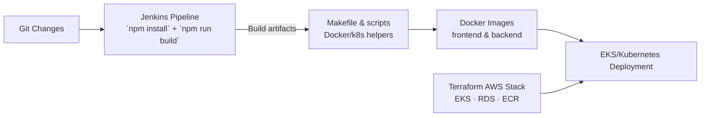
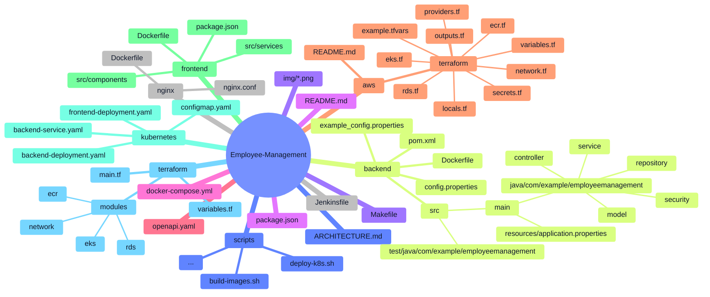
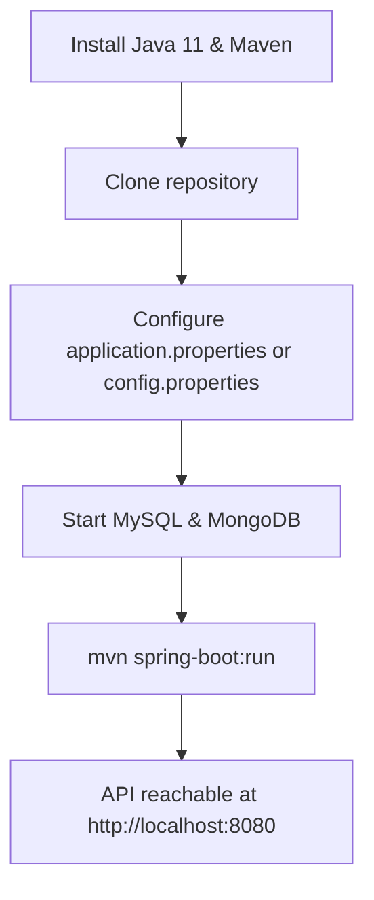
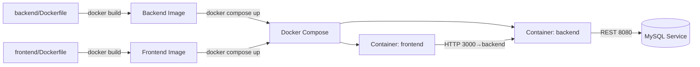
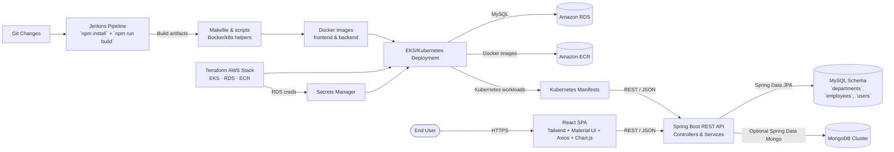
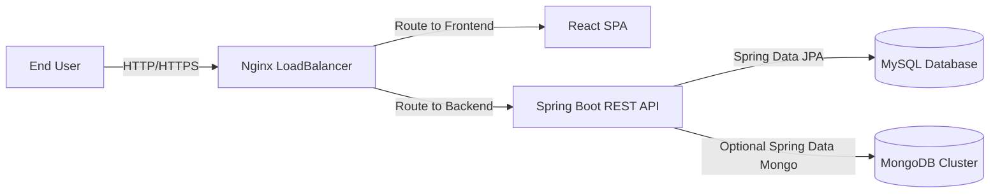
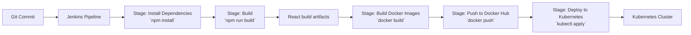

# Employee Management Full-Stack Application

The **Employee Management Full-Stack Application** is a modern, feature-rich system for managing employee and department data, built to demonstrate the power of combining traditional enterprise technologies with modern web frameworks. It leverages a responsive React frontend alongside a robust Spring Boot backend, delivering a seamless user experience with features such as CRUD operations, data visualization, authentication, and secure REST APIs. 

Designed with scalability and maintainability in mind, this application is also fully containerized with Docker, orchestrated with Kubernetes, and supports CI/CD pipelines & blue/green and canary deployment techniques through Jenkins, making it an ideal blueprint for real-world enterprise applications.

<p align="center">
  <a href="https://employee-management-fullstack-app.vercel.app" target="_blank">
    
  </a>
</p>

## Table of Contents

- [Overview](#overview)
- [Architecture at a Glance](#architecture-at-a-glance)
  - [System Context](#system-context)
  - [Request Lifecycle](#request-lifecycle)
  - [DevOps Toolchain](#devops-toolchain)
- [Live Deployment](#live-deployment)
- [Key Technologies](#key-technologies)
- [User Interface](#user-interface)
- [API Endpoints](#api-endpoints)
- [File Structure](#file-structure)
- [Architecture Reference](#architecture-reference)
- [Backend Setup](#backend-setup)
  - [Prerequisites](#1-prerequisites)
  - [Clone the Repository](#2-clone-the-repository)
  - [Install Dependencies](#3-install-dependencies)
  - [Configure the Application](#4-configure-the-application)
  - [Start the Backend Server](#5-start-the-backend-server)
  - [Access the API Endpoints](#6-access-the-api-endpoints)
  - [API Documentation](#7-api-documentation)
    - [Overview](#overview-1)
    - [How to Access the API Documentation](#how-to-access-the-api-documentation)
    - [Benefits of Using Swagger UI](#benefits-of-using-swagger-ui)
  - [Backend JUnit Testing](#8-backend-junit-testing)
- [Frontend Setup](#frontend-setup)
  - [Clone the Repository](#1-clone-the-repository)
  - [Install Dependencies](#2-install-dependencies)
  - [Set Up Environment Variables](#3-set-up-environment-variables)
  - [Start the Development Server](#4-start-the-development-server)
  - [Build for Production](#5-build-for-production)
  - [Test the Application (Optional)](#6-test-the-application-optional)
- [Detailed Component Instructions](#detailed-component-instructions)
- [Containerization](#containerization)
- [Kubernetes](#kubernetes)
- [AWS Production Deployment](#aws-production-deployment)
- [LoadBalancer Service](#loadbalancer-service)
- [Jenkins](#jenkins)
- [OpenAPI Specification](#openapi-specification)
  - [Using the `openapi.yaml` File](#using-the-openapiyaml-file)
- [Troubleshooting](#troubleshooting)
- [Contributing](#contributing)
- [License](#license)
- [Contact](#contact)

## Overview

The Employee Management System is a dynamic full-stack application that seamlessly combines cutting-edge and traditional technologies. By integrating a modern **React** frontend with a classic **Spring Boot** backend, this project demonstrates how new and established technologies can harmoniously work together to create a robust and efficient application for managing employee and department data!


## Architecture at a Glance

- React SPA (Material UI, Tailwind CSS, Chart.js) consumes the Spring Boot REST API over HTTPS via Axios.
- Spring Boot layers (controller → service → repository) persist to MySQL through Spring Data JPA and seed demo data with Faker-powered `DataInitializer`.
- Production-ready deployment with Docker containers, Kubernetes orchestration (blue-green & canary strategies), Terraform infrastructure-as-code, and comprehensive Jenkins CI/CD pipeline with automated testing, security scanning, and multi-strategy deployments.

### System Context



### Request Lifecycle



### DevOps Toolchain


## Live Deployment

The Employee Management System full-stack app is deployed with Vercel and is live at [https://employee-manage-app.vercel.app](https://employee-manage-app.vercel.app) for you to explore and interact with the application.

The backend is also deployed with Render and is available at [https://employee-management-app.onrender.com](https://employee-management-app-gdm5.onrender.com/). You can access the API endpoints directly from the browser at the root (`/`) endpoint as we've set up the Swagger UI documentation for easy testing.

> [!IMPORTANT]
> **Note:** The backend API may spin down due to inactivity, so you may need to wait for up to 2 minutes for the API to start up again. Feel free to test the API endpoints and explore the application. Or, you can run the backend locally and connect it to the frontend for a more seamless experience.

> [!NOTE]
> **Additional Note:** It may take a while to fetch the data and process your requests, as Render's free tier has VERY limited resources (only 512MB RAM and 0.1 CPU).

## Key Technologies

- **React (Frontend)**: A modern JavaScript library for building user interfaces, providing a responsive and interactive experience.
  - **React Router**: A routing library for React that enables navigation and URL handling in single-page applications.
  - **Chart.js**: A JavaScript library for creating responsive and customizable charts and graphs.
  - **Axios**: A promise-based HTTP client for making API requests.
  - **Tailwind CSS**: A utility-first CSS framework for creating custom designs with minimal CSS.
  - **Redux**: A predictable state container for managing application state.
  - **Jest and React Testing Library**: Testing libraries for unit and integration testing React components.
- **Java Spring Boot (Backend)**: A powerful, established Java framework for building production-ready applications with Java, offering robust backend support and data management.
  - **Spring Data JPA**: A part of the Spring Data project that makes it easy to implement JPA-based repositories.
  - **Spring Boot Actuator**: A set of production-ready features that help monitor and manage the application.
  - **Spring Hibernate**: An object-relational mapping (ORM) library for Java that provides a framework for mapping an object-oriented domain model to a relational database.
  - **Spring Boot Starter Web**: A starter for building web applications, including RESTful, application, and WebSocket services.
  - **Spring Boot Starter Data JPA**: A starter for using Spring Data JPA with Hibernate.
  - **RESTful APIs**: Representational state transfer (REST) APIs for communication between the frontend and backend.
  - **Java 11**: The latest LTS version of Java, providing long-term support and stability.
  - **JUnit 5**: A popular testing framework for Java that provides annotations for writing tests.
  - **Swagger**: A tool for documenting and testing RESTful APIs.
- **Docker**: A containerization platform for packaging applications and their dependencies.
- **Kubernetes**: An open-source container orchestration platform for automating deployment, scaling, and management of containerized applications.
- **Jenkins**: An open-source automation server that helps automate the parts of software development related to building, testing, and delivering, facilitating continuous integration and continuous delivery (CI/CD).
- **MySQL**: A reliable relational database for structured data storage.
- **MongoDB**: A flexible NoSQL database for non-relational data.
- **Style Guides**: This project follows the following popular style guides to ensure clean and consistent code.
  - **Airbnb JavaScript Style Guide**: A popular style guide for writing clean and consistent JavaScript code.
  - **Google Java Style Guide**: A style guide for writing Java code that is readable and maintainable.

## User Interface

The frontend of the Employee Management System provides a user-friendly interface for managing employees and departments. It includes features for viewing, adding, editing, and deleting employees and departments. The app also includes visualizations for employee metrics such as growth over time and distribution by age range.

The frontend is also live at [https://employee-management-fullstack-app.vercel.app](https://employee-management-fullstack-app.vercel.app) for you to explore and interact with the application. Note that the backend is not hosted, so the API calls will not work and the data will not be present.

**Landing Page:**

<p align="center" style="cursor: pointer">
  
</p>

**Dashboard Page:**

<p align="center" style="cursor: pointer">
  
</p>

**Employee List Page:**

<p align="center" style="cursor: pointer">
  
</p>

**Department List Page:**

<p align="center" style="cursor: pointer">
  
</p>

**Profile Page:**

<p align="center" style="cursor: pointer">
  
</p>

**Login Page:**

<p align="center" style="cursor: pointer">
  
</p>

**Register Page:**

<p align="center" style="cursor: pointer">
  
</p>

<p align="center">
 And many more features & pages to explore! Feel free to navigate through the application and test the various functionalities.
</p>

## API Endpoints

Here's a table listing all the RESTful API endpoints provided by this application:

| Endpoint                | Method | Description                         |
|-------------------------|--------|-------------------------------------|
| `/api/employees`        | GET    | Get all employees                   |
| `/api/employees/{id}`   | GET    | Get an employee by ID               |
| `/api/employees`        | POST   | Add a new employee                  |
| `/api/employees/{id}`   | PUT    | Update an employee by ID            |
| `/api/employees/{id}`   | DELETE | Delete an employee by ID            |
| `/api/departments`      | GET    | Get all departments                 |
| `/api/departments/{id}` | GET    | Get a department by ID              |
| `/api/departments`      | POST   | Add a new department                |
| `/api/departments/{id}` | PUT    | Update a department by ID           |
| `/api/departments/{id}` | DELETE | Delete a department by ID           |
| `/swagger-ui.html`      | GET    | Access the Swagger UI documentation |

## File Structure



> [!TIP]
> Note: Generated directories such as `node_modules/`, `target/`, and `build/` are omitted for brevity.

## Architecture Reference

For a deeper dive into components, data flow, security posture, and recommended follow-up tasks, see [ARCHITECTURE.md](ARCHITECTURE.md). It cross-references the exact source files (controllers, services, repositories, configuration, tests, and infrastructure) described in this README.

## Backend Setup

### 1. Prerequisites

Ensure that you have Java 11 installed on your local machine. If not, follow the instructions below:

- For MacOS:
    ```bash
    brew install openjdk@11
    export JAVA_HOME=/usr/local/opt/openjdk@11
    ```

- For Windows: Download OpenJDK 11 from [https://jdk.java.net/archive/](https://jdk.java.net/archive/) and follow the installation instructions.

- Also, ensure that MongoDB and MySQL are installed and running on your local machine.

### 2. Clone the Repository

```bash
git clone https://github.com/hoangsonww/Employee-Management-Fullstack-App.git
cd Employee-Management-Fullstack-App  # Fix the paths if necessary
cd backend
```

### 3. Install Dependencies

First, ensure you have [Maven](https://maven.apache.org/) and [Java JDK](https://www.oracle.com/java/technologies/javase-jdk11-downloads.html) installed. Run the following command to install them:

- For MacOS:
    ```bash
    brew install maven
    ```
- For Windows: Download Maven from [https://maven.apache.org/download.cgi](https://maven.apache.org/download.cgi) and follow the installation instructions.

Next, install the project dependencies:

```bash
mvn install
```

### 4. Configure the Application

Update `src/main/resources/application.properties` with your MySQL and MongoDB configuration:

```properties
# MySQL Configuration
spring.datasource.url=jdbc:mysql://localhost:3306/employee_management
spring.datasource.username=root
spring.datasource.password=password
spring.jpa.hibernate.ddl-auto=update

# MongoDB Configuration
spring.data.mongodb.uri=mongodb://localhost:27017/employee_management
```

Feel free to change the database name, username, and password, and even add more configurations as needed.

Alternatively, create a `config.properties` file in the `backend` directory and keep the `application.properties` file as is. Add the following properties to the `config.properties` file:

```properties
MYSQL_HOST=<mysql_host>
MYSQL_PORT=<mysql_port>
MYSQL_DB=<mysql_db>
MYSQL_USER=<mysql_user>
MYSQL_PASSWORD=<mysql_password>
MYSQL_SSL_MODE=<mysql_ssl_mode>
MONGO_URI=<mongo_host>
```

### 5. Start the Backend Server

Before starting the server, ensure that MySQL and MongoDB are running and properly configured on your local machine!

Then, run the following command to start the Spring Boot application:

```bash
mvn spring-boot:run
```

The backend will be available at [http://localhost:8080](http://localhost:8080).

### 6. Access the API Endpoints

- **Get All Employees:**

  ```bash
  curl -X GET http://localhost:8080/api/employees
  ```

- **Get Employee by ID:**

  ```bash
  curl -X GET http://localhost:8080/api/employees/1
  ```

- **Get All Departments:**

  ```bash
  curl -X GET http://localhost:8080/api/departments
  ```

- **Get Department by ID:**

  ```bash
  curl -X GET http://localhost:8080/api/departments/1
  ```

- **Feel free to add more API endpoints as needed...**



### 7. API Documentation

#### Overview

This application also uses Swagger to provide an interactive API documentation interface. The Swagger UI allows developers to explore the available API endpoints, view detailed information about each endpoint, and test the endpoints directly from the browser.

#### How to Access the API Documentation

1. **Start the Backend Server**: Ensure that the backend server is running. You can start the server by navigating to the backend directory and running:

   ```bash
   mvn spring-boot:run
   ```

2. **Open the Swagger UI**: Once the server is up and running, you can access the Swagger UI by navigating to the following URL in your web browser:

   [http://localhost:8080/swagger-ui.html](http://localhost:8080/swagger-ui.html)

   This will open the Swagger interface where you can explore the API endpoints.

3. Alternatively, for those who need the raw OpenAPI JSON, it is available at:

   [http://localhost:8080/v3/api-docs](http://localhost:8080/v3/api-docs)

4. **Explore the API Endpoints**:
- Use the sidebar or the search bar to navigate through the available API endpoints.
- Click on an endpoint to view its details, including the request method (GET, POST, PUT, DELETE), parameters, request body, and possible responses.
- You can also test the endpoints directly by clicking the **"Try it out"** button, providing the necessary input, and executing the request.
- If you have everything set up correctly, you should see the following Swagger UI interface:

<p align="center" style="cursor: pointer">
  
</p>

#### Benefits of Using Swagger UI

- **Interactive Documentation**: Developers can easily understand and use the API.
- **Quick Testing**: Test the API endpoints directly from the browser without needing a separate tool.
- **Clear Communication**: Provides a standardized way of documenting your API, making it easier for others to understand and consume.

### 8. Backend JUnit Testing

To run the unit and integration tests, use:

```bash
mvn test
```

This will run the tests and provide you with the results. Ensure that all tests pass before making any changes to the application.

Feel free to add more tests as needed to ensure the reliability and correctness of your application.

## Frontend Setup

### 1. Clone the Repository

```bash
git clone https://github.com/hoangsonww/Employee-Management-Fullstack-App.git
cd frontend
```

### 2. Install Dependencies

Ensure you have [Node.js](https://nodejs.org/) and [npm](https://www.npmjs.com/) installed. Run the following command to install the required dependencies:

```bash
npm install
```

### 3. Set Up Environment Variables

Create a `.env` file in the root of your project if it doesn't already exist. Add the following environment variable:

```env
REACT_APP_API_URL=http://localhost:8080/api
```

### 4. Start the Development Server

Run the following command to start the React development server:

```bash
npm start
```

The frontend will be available at [http://localhost:3000](http://localhost:3000).

### 5. Build for Production

To create a production build of your application, run:

```bash
npm run build
```

The build files will be generated in the `build` directory. You can deploy these files to your production server.

### 6. Test the Application (Optional)

To run tests for the frontend application, use the following command:

```bash
npm test
```

**NOTE: You might need different IDEs for the backend and the frontend. FYI, I used IntelliJ IDEA for the backend and Webstorm for the frontend.**

## Detailed Component Instructions

### `Dashboard.js`

Displays various metrics related to employees, such as total employee count, average age, employee growth over time, and distribution by age range. It uses `react-chartjs-2` to render bar charts.

### `EmployeeList.js`

Shows a list of employees with options to search, paginate, and delete entries. Includes a link to add a new employee and edit existing employees.

### `EmployeeForm.js`

Provides a form for adding or editing employee details. Fetches departments to populate the department dropdown. Uses `useParams` to determine if it's in edit mode or add mode.

### `DepartmentList.js`

Displays a list of departments with options to search, paginate, and delete entries. Includes a link to add a new department and edit existing departments.

### `DepartmentForm.js`

Provides a form for adding or editing department details.

### `Navbar.js`

The navigation bar component that includes links to various pages such as Dashboard, Employees, and Departments. Highlights the currently active page.

## Containerization

If you'd also like to containerize the project, the project also includes the `dockerfile` and `docker-compose.yaml` files for containerization. You can build and run the application in a Docker container using the following command:

```bash
docker compose up --build
```

This command will build the Docker images for the frontend and backend, create containers, and start the application. Feel free to view them in Docker Desktop.

Alternatively, you can navigate to the `backend` and `frontend` directories and build the Docker images separately using the following commands:

```bash
docker build -t <your_docker_username>/employee-management-app-backend .
docker build -t <your_docker_username>/employee-management-app-frontend .
```

Then, you can run the containers using the following commands:

```bash
docker run -p 8080:8080 <your_docker_username>/employee-management-app-backend
docker run -p 3000:3000 <your_docker_username>/employee-management-app-frontend
```

Also, you can push the Docker images to Docker Hub using the following commands:

```bash
docker push <your_docker_username>/employee-management-app-backend
docker push <your_docker_username>/employee-management-app-frontend
```

Additionally, you can access the image on **Docker Hub** **[here](https://hub.docker.com/repository/docker/hoangsonw/employee-management-app/).**



## Kubernetes

The project includes production-ready Kubernetes manifests with support for advanced deployment strategies:

### Deployment Strategies

- **Rolling Deployment**: Gradual zero-downtime updates with automatic rollback
- **Blue-Green Deployment**: Complete environment switch for instant rollback capability
- **Canary Deployment**: Gradual traffic shift to validate new versions (10% → 100%)

### Production Features

- **High Availability**: 3 replicas per deployment with pod anti-affinity
- **Auto-Scaling**: Horizontal Pod Autoscaler based on CPU/memory metrics
- **Security**: Network policies, RBAC, non-root containers, secrets encryption
- **Observability**: Health probes, Prometheus metrics, CloudWatch integration
- **Resilience**: Pod Disruption Budgets, graceful shutdown, automatic rollback

### Quick Start

```bash
# Deploy using blue-green strategy
cd kubernetes
export ECR_REGISTRY=<your-ecr-url>
export IMAGE_TAG=v1.0.0

envsubst < backend-deployment-blue.yaml | kubectl apply -f -
envsubst < frontend-deployment-blue.yaml | kubectl apply -f -

# Or use deployment scripts
./scripts/deploy-blue-green.sh green v1.2.3
./scripts/switch-blue-green.sh green

# Canary deployment
./scripts/deploy-canary.sh v1.2.3
./scripts/promote-canary.sh v1.2.3
```

For comprehensive deployment instructions, see **[kubernetes/DEPLOYMENT-GUIDE.md](kubernetes/DEPLOYMENT-GUIDE.md)**.

## AWS Production Deployment

The `aws/terraform/` directory contains a comprehensive Terraform stack for production-grade AWS infrastructure:

### Infrastructure Components

- **Networking**: Multi-AZ VPC with public/private subnets, NAT gateways, and security groups
- **Compute**: Amazon EKS cluster with:
  - Production node group (ON_DEMAND instances)
  - Spot instance node group for cost optimization
  - Cluster Autoscaler for dynamic scaling
  - IMDSv2 enforcement for security
  - Encrypted EBS volumes
- **Data**: Amazon RDS MySQL with:
  - Multi-AZ deployment for high availability
  - Automated backups (14-day retention)
  - Encryption at rest with KMS
  - Secrets Manager integration
- **Registry**: Amazon ECR repositories with:
  - Image lifecycle policies
  - Vulnerability scanning
  - Immutable image tags
- **IAM & Security**:
  - IRSA (IAM Roles for Service Accounts) for pods
  - AWS Load Balancer Controller IAM role
  - Cluster Autoscaler IAM role
  - KMS encryption for EKS secrets
  - CloudWatch logging for control plane

### Production Enhancements

- **Cluster Encryption**: KMS-encrypted Kubernetes secrets
- **Control Plane Logging**: API, audit, authenticator, controller, scheduler logs
- **Service Accounts**: Pre-configured IAM roles for backend, load balancer controller, autoscaler
- **Node Groups**: Separate production and spot node groups with proper taints/labels
- **Monitoring**: CloudWatch Container Insights integration

### Deployment

As mentioned, we fully support blue/green and canary deployment strategies with the provided Kubernetes manifests and deployment scripts on top of the AWS infrastructure.

```bash
cd aws/terraform
terraform init
terraform plan
terraform apply

# Get cluster access
aws eks update-kubeconfig --region us-east-1 --name employee-management-eks
```



Follow the step-by-step instructions in [`aws/README.md`](aws/README.md) to apply the Terraform plan, push Docker images, surface database credentials as Kubernetes secrets, and roll out the workloads. For full deployment guide, refer to [kubernetes/DEPLOYMENT-GUIDE.md](kubernetes/DEPLOYMENT-GUIDE.md).

## LoadBalancer Service

The project also features Nginx as a LoadBalancer service for routing traffic to the frontend and backend services. The Nginx configuration file is located in the `nginx` directory.

There is also a `Dockerfile` for building the Nginx image. We are using this file to build the Nginx image and deploy it to the cloud with Render, which we are currently using to balance the traffic of the frontend and backend services.

Feel free to customize the Nginx configuration to suit your specific requirements and deployment process.



## Jenkins

The project includes a comprehensive CI/CD pipeline with support for multiple deployment strategies:

### Pipeline Features

- **Multi-Strategy Support**: Choose between Rolling, Blue-Green, or Canary deployments
- **Parallel Execution**: Backend and frontend builds run concurrently
- **Security Scanning**: Trivy vulnerability scanning for Docker images
- **Quality Checks**: Linting, testing, and code quality gates
- **Auto-Rollback**: Automatically rolls back failed deployments
- **Health Verification**: Post-deployment smoke tests and monitoring

### Pipeline Parameters

```groovy
DEPLOYMENT_STRATEGY: 'rolling' | 'blue-green' | 'canary'
ACTIVE_VERSION: 'blue' | 'green'
CANARY_WEIGHT: '10' (percentage of traffic)
AUTO_ROLLBACK: true | false
SKIP_TESTS: true | false
```

### Pipeline Stages

1. **Initialize**: Workspace setup and Git checkout
2. **Install Dependencies**: Parallel backend and frontend dependency installation
3. **Code Quality & Security**: Linting and security scans
4. **Run Tests**: JUnit (backend) and Jest (frontend) tests
5. **Build Applications**: Maven/npm build processes
6. **Build & Push Images**: Docker image creation and ECR push
7. **Image Security Scan**: Container vulnerability assessment
8. **Configure kubectl**: EKS cluster authentication
9. **Deploy**: Strategy-specific deployment (rolling/blue-green/canary)
10. **Post-Deployment Tests**: Smoke tests and health checks
11. **Monitor**: Deployment status verification

### Usage

Create a Jenkins pipeline job and point it to the `Jenkinsfile`. The pipeline will automatically detect deployment parameters and execute the appropriate strategy.



## OpenAPI Specification

### Using the `openapi.yaml` File

1. **View the API Documentation**
- Open [Swagger Editor](https://editor.swagger.io/).
- Upload the `openapi.yaml` file or paste its content.
- Visualize and interact with the API documentation.

2. **Test the API**
- Import `openapi.yaml` into [Postman](https://www.postman.com/):
  - Open Postman → Import → Select `openapi.yaml`.
  - Test the API endpoints directly from Postman.
- Or use [Swagger UI](https://swagger.io/tools/swagger-ui/):
  - Provide the file URL or upload it to view and test endpoints.

3. **Generate Client Libraries**
- Install OpenAPI Generator:
  ```bash
  npm install @openapitools/openapi-generator-cli -g
  ```
- Generate a client library:
  ```bash
  openapi-generator-cli generate -i openapi.yaml -g <language> -o ./client
  ```
- Replace `<language>` with the desired programming language.

4. **Generate Server Stubs**
- Generate a server stub:
  ```bash
  openapi-generator-cli generate -i openapi.yaml -g <framework> -o ./server
  ```
- Replace `<framework>` with the desired framework.

5. **Run a Mock Server**
- Install Prism:
  ```bash
  npm install -g @stoplight/prism-cli
  ```
- Start the mock server:
  ```bash
  prism mock openapi.yaml
  ```

6. **Validate the OpenAPI File**
- Use [Swagger Validator](https://validator.swagger.io/):
  - Upload `openapi.yaml` or paste its content to check for errors.

This guide enables you to view, test, and utilize the API. Feel free to explore the OpenAPI Specification and integrate it into your development workflow.

## Troubleshooting

### Backend Issues

- **`Could not autowire` Errors**: Ensure that all dependencies are correctly defined in the `pom.xml` and that the repository interfaces are located in the correct package structure.

- **`Exception opening socket` for MongoDB**: Verify that MongoDB is running and accessible at `localhost:27017`. Check MongoDB logs for any connection issues.

- **`Build failed`**: Ensure that you are using Java 11 and that all dependencies are correctly installed. Check the `pom.xml` file for any missing dependencies.

- Regardless of the error, perhaps you can try running the following commands to clean and rebuild the project:

  ```bash
  mvn clean install
  ```

  If the issue persists, you can run Maven with more detailed logging to identify the problem:

  ```bash
  mvn -X spring-boot:run
  ```

### Frontend Issues

- **Error: Cannot read properties of undefined (reading 'id')**: Ensure that the `employee` object in `EmployeeForm` is correctly initialized and that the `id` parameter is correctly passed. Check the `getEmployeeById` and `updateEmployee` functions for proper handling of data.

- **Chart Issues**: Ensure `Chart.js` and `react-chartjs-2` are correctly installed and configured. Verify that the chart data passed to components is in the correct format.

- Regardless of the error, perhaps you can try running the following commands to clean and rebuild the project:

  ```bash
  npm install
  ```

  If the issue persists, you can run the React development server with more detailed logging to identify the problem:

  ```bash
  npm start --verbose
  ```

## Contributing

If you'd like to contribute to the project, please fork the repository and submit a pull request with your changes. Ensure that you follow the project's coding standards and include relevant tests for new features.

## License

This project is licensed under the **MIT License.** See the [LICENSE](LICENSE) file for details.

## Contact

For any questions or issues, please contact [hoangson091104@gmail.com](mailto:hoangson091104@gmail.com).

---

Thank you for checking out the **Employee Management Full-Stack Application!** Feel free to use this project for your own learning or development purposes.

Created with ❤️ by [Son Nguyen](https://github.com/hoangsonww) in 2024.

---

**[⬆ Back to Top](#employee-management-full-stack-application)**
