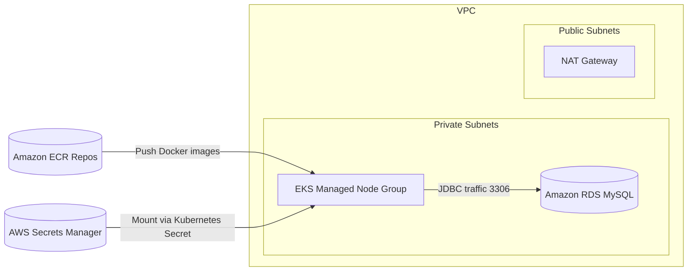

# AWS Production Deployment

This folder contains a Terraform-based blueprint that provisions the AWS infrastructure required to run the Employee Management System in a production setting. It focuses on providing a secure, scalable foundation that aligns with the code in this repository (React frontend, Spring Boot backend, MySQL persistence, and containerized workloads).

## What Gets Provisioned



**VPC & networking**
- Multi-AZ VPC with public and private subnets (private subnets host compute and databases).
- Managed NAT gateway for outbound internet access from private subnets.

**Compute platform**
- Amazon EKS cluster with a managed node group sized by Terraform variables.
- IRSA enabled so workloads can assume AWS IAM roles when needed.

**Data layer**
- Amazon RDS for MySQL with encryption, automated backups, maintenance windows, and security group rules that only allow access from the EKS worker nodes.
- Database connection details stored in AWS Secrets Manager.

**Container registry**
- Separate Amazon ECR repositories for frontend and backend images with image scanning and lifecycle policies.

> The stack intentionally keeps MongoDB/DocumentDB optional because the current Spring Boot code does not persist to Mongo. Add a DocumentDB module only if you introduce Mongo-backed repositories.

## Prerequisites

- Terraform 1.4 or later.
- AWS CLI v2 configured with an account that can create VPC, EKS, RDS, ECR, IAM, and Secrets Manager resources.
- kubectl 1.27+ for interacting with the cluster.
- Docker (or an equivalent build system) for building container images.

## Quick Start

1. **Set Terraform variables**
   - Copy `aws/terraform/example.tfvars` (create this file) or create your own `terraform.tfvars` in `aws/terraform/`.
   - At minimum provide a strong `db_password`. Example:
     ```hcl
     project_name    = "employee-management"
     environment     = "prod"
     aws_region      = "us-east-1"
     db_password     = "changeMeSuperSecure123!"
     single_nat_gateway = false  # optional, enable one NAT per AZ for higher availability
     ```

2. **Deploy the infrastructure**
   ```bash
   cd aws/terraform
   terraform init
   terraform plan
   terraform apply
   ```

3. **Grab the connection details**
   ```bash
   terraform output
   terraform output eks_update_kubeconfig_command
   ```

4. **Configure kubectl**
   ```bash
   aws eks update-kubeconfig --region <region> --name <cluster_name>
   ```

5. **Build & push container images**
   ```bash
   # Backend
   docker build -t $(terraform output -raw backend_ecr_repository):<tag> ../../backend
   docker push $(terraform output -raw backend_ecr_repository):<tag>

   # Frontend (serves the React production build)
   docker build -t $(terraform output -raw frontend_ecr_repository):<tag> ../../frontend
   docker push $(terraform output -raw frontend_ecr_repository):<tag>
   ```

6. **Create Kubernetes secrets for database connectivity**
   ```bash
   # Fetch the secret from Secrets Manager
   aws secretsmanager get-secret-value \
     --secret-id $(terraform output -raw mysql_secret_name) \
     --query 'SecretString' --output text > mysql-creds.json

   kubectl create secret generic mysql-credentials \
     --from-file=mysql-creds.json=mysql-creds.json \
     --namespace default
   rm mysql-creds.json
   ```
   Update `kubernetes/backend-deployment.yaml` to mount these credentials as environment variables (e.g., via `envFrom.secretRef`).

7. **Update Kubernetes manifests**
   - Set the backend deployment image to the pushed ECR tag (port 8080).
   - Set the frontend deployment image to the pushed ECR tag (port 80) or deploy the static build via another mechanism.
   - Inject `SPRING_DATASOURCE_URL`, `SPRING_DATASOURCE_USERNAME`, and `SPRING_DATASOURCE_PASSWORD` using the secret created above.
   - Apply manifests:
     ```bash
     kubectl apply -f ../../kubernetes
     ```

## Managing the Database

- **Backups**: Automated backups retain `db_backup_retention` days (default 14). Adjust the variable as needed.
- **Maintenance**: Controlled by `db_maintenance_window`. Terraform keeps the setting consistent across terraform runs.
- **Failover**: `db_multi_az` defaults to `true` to give automatic failover. Disable only for dev/test environments.
- **Secrets**: `aws/terraform/secrets.tf` writes credentials to Secrets Manager. Rotate the password by updating `db_password` and reapplying Terraform.

## Scaling & Resilience

- **EKS nodes**: Adjust `eks_node_desired`, `eks_node_min`, and `eks_node_max` in `terraform.tfvars` to scale compute capacity.
- **RDS storage**: Increase `db_allocated_storage` and `db_max_allocated_storage` to grow storage limits.
- **Network**: Switch `single_nat_gateway` to `false` to provision one NAT gateway per AZ for higher availability.

## Clean Up

Terraform enables deletion protection on the database. To tear everything down:
1. Set `db_deletion_protection = false` in `terraform.tfvars` and run `terraform apply`.
2. Run `terraform destroy` when you are ready to delete the stack.
3. Manually remove any remaining ECR images or S3 assets if you created additional resources.

## Variables Recap

| Variable | Purpose | Default |
|----------|---------|---------|
| `project_name` | Prefix for resource names and tags | `employee-management` |
| `environment` | Environment identifier appended to names | `prod` |
| `aws_region` | Deployment region | `us-east-1` |
| `availability_zone_count` | Number of AZs to target | `3` |
| `db_password` | **Required** MySQL admin password | _none_ |
| `db_multi_az` | Enable Multi-AZ for RDS | `true` |
| `single_nat_gateway` | Use one NAT gateway across AZs | `true` |
| `ecr_image_retain_count` | Number of Docker images to retain | `10` |

See `aws/terraform/variables.tf` for the full list and documentation.

## Security Notes

- Terraform stores the database password in state. Use secure backend storage (e.g., Terraform Cloud, S3 with encryption) and restrict access.
- Rotate Secrets Manager entries regularly (`aws secretsmanager rotate-secret` or Terraform updates).
- Tighten CORS configuration in the Spring Boot app before exposing APIs publicly.
- Lock down Kubernetes RBAC and network policies—the provided manifests are intentionally minimal.

## Extending the Stack

- **Ingress Controller**: Deploy AWS Load Balancer Controller via Helm to expose the backend through an ALB.
- **TLS & DNS**: Terminate TLS using AWS Certificate Manager and Route 53 once a domain is available.
- **Static Frontend**: Host the React build in S3 + CloudFront if you prefer static site delivery over a containerized frontend.
- **Monitoring**: Install AWS Observability Accelerator, Prometheus, or Datadog agents for metrics and logging.

---

The provided Terraform modules have been tested for syntactic correctness, but always review plan outputs and adjust to your organization's requirements before deploying to a live AWS account.

> [!TIP]
> This one-click deployment will allow you to experiment with the Employee Management System in a production-like environment. Feel free to set up and deploy your own instance of the full stack application using this guide. However, for any serious usage, ensure you understand the security and cost implications of running resources in AWS.
