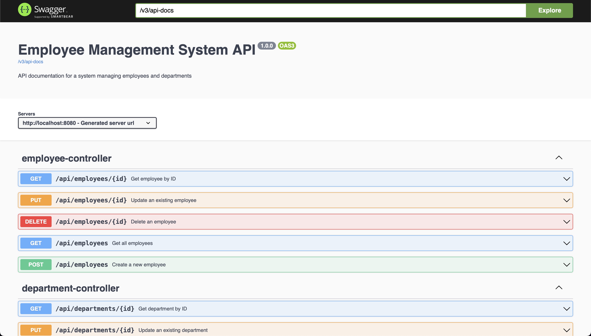

# Employee Management System - Backend

## Overview

The backend of the Employee Management System is built using Spring Boot, a powerful Java framework designed to simplify the development of production-ready applications. This backend provides a RESTful API for managing employee and department data, connecting to both MySQL and MongoDB databases.

## Features

- **RESTful API**: Provides endpoints for CRUD operations on employees and departments.
- **Data Initialization**: Includes sample data for departments and employees.
- **Integration**: Connects to both MySQL and MongoDB databases.
- **Exception Handling**: Custom error handling for not found resources.

## Technologies

- **Spring Boot**: Framework for building production-ready applications with Java.
- **MySQL**: Relational database for structured data storage.
- **MongoDB**: NoSQL database for non-relational data storage.

## File Structure

```
employee-management-app
│
├── docker-compose.yaml
│
├── backend
│   ├── src
│   │   ├── main
│   │   │   ├── java
│   │   │   │   └── com
│   │   │   │       └── example
│   │   │   │           └── employeemanagement
│   │   │   │               ├── EmployeeManagementApplication.java
│   │   │   │               ├── config
│   │   │   │               │   └── CorsConfig.java
│   │   │   │               │   └── DataInitializer.java
│   │   │   │               ├── controller
│   │   │   │               │   ├── DepartmentController.java
│   │   │   │               │   └── EmployeeController.java
│   │   │   │               ├── model
│   │   │   │               │   ├── Department.java
│   │   │   │               │   └── Employee.java
│   │   │   │               ├── repository
│   │   │   │               │   ├── DepartmentRepository.java
│   │   │   │               │   └── EmployeeRepository.java
│   │   │   │               ├── service
│   │   │   │               │   └── DataInitializer.java
│   │   │   │               └── exception
│   │   │   │                   └── ResourceNotFoundException.java
│   │   │   └── resources
│   │   │       ├── application.properties
│   │   │       └── data.sql
│   │   └── test
│   │       └── java
│   │           └── com
│   │               └── example
│   │                   └── employeemanagement
│   │                       └── EmployeeManagementApplicationTests.java
│   ├── .gitignore
│   └── pom.xml
│   └── compose.yaml
│
└── frontend
    └── (frontend code)
```

## Setup Instructions

#### Important: Java 11 is required to run this project.

### 1. Clone the Repository

```bash
git clone https://github.com/hoangsonww/Employee-Management-Fullstack-App.git
cd Employee-Management/backend
```

### 2. Install Dependencies

Ensure you have [Maven](https://maven.apache.org/) and [Java JDK](https://www.oracle.com/java/technologies/javase-jdk11-downloads.html) installed. Run the following command to install the required dependencies:

```bash
mvn install -DskipTests
```

### 3. Configure the Application

Update `src/main/resources/application.properties` with your database configuration:

```properties
# MySQL Configuration
spring.datasource.url=jdbc:mysql://localhost:3306/employee_management
spring.datasource.username=root
spring.datasource.password=password
spring.jpa.hibernate.ddl-auto=update

# MongoDB Configuration
spring.data.mongodb.uri=mongodb://localhost:27017/employee_management
```

Ensure the databases are set up as expected and the URLs, usernames, and passwords match your local or remote database setup.

### 4. Start the Backend Server

Run the following command to start the Spring Boot application:

```bash
mvn spring-boot:run
```

The backend server will be available at [http://localhost:8080](http://localhost:8080).

### 5. Access the API Endpoints

Here are some example API endpoints you can use to interact with the backend:

- **Get All Employees:**

  ```bash
  curl -X GET http://localhost:8080/api/employees
  ```

- **Get Employee by ID:**

  ```bash
  curl -X GET http://localhost:8080/api/employees/1
  ```

- **Create a New Employee:**

  ```bash
  curl -X POST http://localhost:8080/api/employees -H "Content-Type: application/json" -d '{"firstName": "John", "lastName": "Doe", "email": "john.doe@example.com", "departmentId": 1}'
  ```

- **Update an Employee:**

  ```bash
  curl -X PUT http://localhost:8080/api/employees/1 -H "Content-Type: application/json" -d '{"firstName": "John", "lastName": "Doe", "email": "john.doe@example.com", "departmentId": 1}'
  ```

- **Delete an Employee:**

  ```bash
  curl -X DELETE http://localhost:8080/api/employees/1
  ```

- **Get All Departments:**

  ```bash
  curl -X GET http://localhost:8080/api/departments
  ```

- **Get Department by ID:**

  ```bash
  curl -X GET http://localhost:8080/api/departments/1
  ```

### 6. Data Initialization

The `DataInitializer.java` class is used to preload sample data into the database. This is particularly useful for development and testing.

### 7. Running Tests

To run the unit and integration tests, use:

```bash
mvn test
```

## Detailed File Descriptions

### `EmployeeManagementApplication.java`

The main class that serves as the entry point for the Spring Boot application.

### `DepartmentController.java` and `EmployeeController.java`

REST controllers for handling HTTP requests related to departments and employees, respectively.

### `Department.java` and `Employee.java`

Entity classes representing the `departments` and `employees` tables in the MySQL database.

### `DepartmentRepository.java` and `EmployeeRepository.java`

Repository interfaces for performing CRUD operations on the `departments` and `employees` entities.

### `DataInitializer.java`

A service class that initializes the database with sample data upon application startup.

### `ResourceNotFoundException.java`

A custom exception class used for handling cases where requested resources are not found.

### `application.properties`

Configuration file for Spring Boot, including database connection settings.

### `data.sql`

SQL script for preloading sample data into the MySQL database.

## Swagger API Documentation

The backend API is documented using Swagger, which provides a user-friendly interface for exploring the available endpoints. To access the Swagger UI, navigate to [http://localhost:8080/swagger-ui.html](http://localhost:8080/swagger-ui.html) after starting the backend server.

If you have everything set up correctly, you should see the Swagger UI with a list of available endpoints and the ability to test them directly from the browser:

<p align="center" style="cursor: pointer">
  
</p>

## Troubleshooting

### Common Issues

- **`Could not autowire` Errors**: Ensure all Spring Boot components (controllers, services, repositories) are correctly annotated and located in the appropriate package structure.

- **`Exception opening socket` for MongoDB**: Verify that MongoDB is running and accessible at `localhost:27017`. Check MongoDB logs for connection issues.

- **`SQLSyntaxErrorException`**: Check the `data.sql` script and ensure the MySQL database schema matches the expected structure.

- **`Port Already in Use`**: If the default port `8080` is already in use, change the port in `application.properties` or terminate the conflicting process.

- **`CORS Error`**: If you encounter CORS issues, ensure that the `CorsConfig.java` class is correctly configured.

- **`Build failed`**: If the Maven build fails, check if you are using Java 11 and have the necessary dependencies installed. Also, check the error logs for more details.

## Contributing

If you'd like to contribute to the backend development, please fork the repository and submit a pull request with your changes. Ensure that you follow the project's coding standards and include relevant tests for new features.

## License

This project is licensed under the MIT License. See the [LICENSE](LICENSE) file for details.

## More Information

For more information about this project, please refer to the comprehensive [documentation](../README.md).

## Contact

For any questions or issues, please contact [hoangson091104@gmail.com](mailto:hoangson091104@gmail.com).

---
