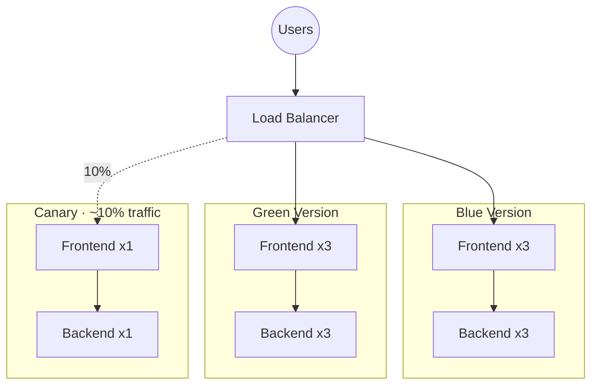

# Kubernetes Deployment Guide

This guide provides comprehensive instructions for deploying the Employee Management System to Kubernetes using production-ready deployment strategies.

## Table of Contents

- [Overview](#overview)
- [Prerequisites](#prerequisites)
- [Architecture](#architecture)
- [Deployment Strategies](#deployment-strategies)
  - [Rolling Deployment](#rolling-deployment)
  - [Blue-Green Deployment](#blue-green-deployment)
  - [Canary Deployment](#canary-deployment)
- [Initial Setup](#initial-setup)
- [Deployment Workflows](#deployment-workflows)
- [Monitoring and Rollback](#monitoring-and-rollback)
- [Troubleshooting](#troubleshooting)

## Overview

The Employee Management System deployment infrastructure supports three production-ready deployment strategies:

1. **Rolling Deployment** - Gradual update with zero downtime
2. **Blue-Green Deployment** - Complete environment switch for instant rollback
3. **Canary Deployment** - Gradual traffic shift to validate new versions

## Prerequisites

- Kubernetes cluster (v1.27+) - preferably AWS EKS
- `kubectl` CLI configured to access your cluster
- Docker images built and pushed to ECR
- AWS CLI configured with appropriate permissions
- Terraform (for infrastructure provisioning)
- envsubst (for template substitution)

## Architecture



## Deployment Strategies

### Rolling Deployment

**When to use**: Regular updates, incremental rollouts

**Process**:
1. New pods are created with the updated version
2. Old pods are terminated gradually
3. Automatic rollback if health checks fail

**Pros**:
- Simple and straightforward
- Zero downtime
- Resource efficient

**Cons**:
- Both versions run simultaneously
- Slower rollout
- Potential for version conflicts

**Command**:
```bash
# Using kubectl
kubectl set image deployment/backend-deployment backend=<new-image>
kubectl set image deployment/frontend-deployment frontend=<new-image>

# Using Jenkinsfile
# Select DEPLOYMENT_STRATEGY: rolling
```

### Blue-Green Deployment

**When to use**: Major releases, database migrations, testing in production

**Process**:
1. Deploy new version (green) alongside current version (blue)
2. Test green environment thoroughly
3. Switch traffic from blue to green
4. Keep blue for instant rollback

**Pros**:
- Instant rollback capability
- Complete testing before traffic switch
- Clear separation of environments

**Cons**:
- Requires double resources
- More complex setup
- Database migrations need careful planning

**Command**:
```bash
# Deploy to green environment
./scripts/deploy-blue-green.sh green v1.2.3

# Switch traffic to green
./scripts/switch-blue-green.sh green

# Rollback to blue if needed
./scripts/switch-blue-green.sh blue
```

### Canary Deployment

**When to use**: High-risk changes, gradual rollouts, A/B testing

**Process**:
1. Deploy canary version with limited replicas
2. Route small percentage of traffic to canary
3. Monitor metrics and errors
4. Gradually increase traffic or rollback
5. Promote canary to production

**Pros**:
- Gradual risk mitigation
- Real user traffic testing
- Easy to rollback

**Cons**:
- More complex monitoring
- Requires traffic splitting
- Longer deployment time

**Command**:
```bash
# Deploy canary
./scripts/deploy-canary.sh v1.2.3

# Monitor for 5-10 minutes
kubectl get pods -l version=canary
kubectl logs -l version=canary -f

# Promote if healthy
./scripts/promote-canary.sh v1.2.3

# Or rollback
./scripts/rollback-canary.sh
```

## Initial Setup

### 1. Configure AWS and Kubernetes

```bash
# Update kubeconfig
aws eks update-kubeconfig --region us-east-1 --name employee-management-eks

# Verify connection
kubectl cluster-info
kubectl get nodes
```

### 2. Create Secrets

```bash
# Get RDS endpoint from Terraform outputs
RDS_ENDPOINT=$(terraform -chdir=aws/terraform output -raw mysql_endpoint)

# Create backend secrets
kubectl create secret generic backend-secrets \
  --from-literal=db-host=${RDS_ENDPOINT} \
  --from-literal=db-port=3306 \
  --from-literal=db-name=employee_management \
  --from-literal=db-username=empmgr \
  --from-literal=db-password=<YOUR_PASSWORD> \
  --from-literal=jwt-secret=$(openssl rand -base64 32) \
  --from-literal=encryption-key=$(openssl rand -base64 32)
```

### 3. Apply Base Resources

```bash
cd kubernetes

# Apply RBAC and ConfigMaps
kubectl apply -f rbac.yaml
kubectl apply -f configmap-production.yaml

# Apply network policies
kubectl apply -f network-policy.yaml

# Apply HPA and PDB
kubectl apply -f hpa.yaml
kubectl apply -f pdb.yaml
```

### 4. Update IAM Role ARNs

Get the IAM role ARNs from Terraform:

```bash
# Backend service account
terraform -chdir=aws/terraform output -raw backend_irsa_role_arn

# Update kubernetes/rbac.yaml with the ARN
```

### 5. Build and Push Docker Images

```bash
# Set variables
export AWS_REGION=us-east-1
export ECR_REGISTRY=$(terraform -chdir=aws/terraform output -raw backend_ecr_repository | cut -d'/' -f1)
export IMAGE_TAG=v1.0.0

# Login to ECR
aws ecr get-login-password --region $AWS_REGION | \
  docker login --username AWS --password-stdin $ECR_REGISTRY

# Build and push backend
cd backend
docker build -t $ECR_REGISTRY/employee-management-backend:$IMAGE_TAG .
docker push $ECR_REGISTRY/employee-management-backend:$IMAGE_TAG

# Build and push frontend
cd ../frontend
docker build -t $ECR_REGISTRY/employee-management-frontend:$IMAGE_TAG .
docker push $ECR_REGISTRY/employee-management-frontend:$IMAGE_TAG
```

## Deployment Workflows

### Jenkins CI/CD Pipeline

The Jenkinsfile supports all three deployment strategies through parameters:

```groovy
pipeline {
  parameters {
    choice(name: 'DEPLOYMENT_STRATEGY', choices: ['rolling', 'blue-green', 'canary'])
    choice(name: 'ACTIVE_VERSION', choices: ['blue', 'green'])
    string(name: 'CANARY_WEIGHT', defaultValue: '10')
    booleanParam(name: 'AUTO_ROLLBACK', defaultValue: true)
  }
}
```

**Running the Pipeline**:

1. Go to Jenkins
2. Select "Build with Parameters"
3. Choose deployment strategy
4. Specify image tag or use auto-generated from Git commit
5. Click "Build"

### Manual Deployment

#### Blue-Green Deployment

```bash
# 1. Set environment variables
export ECR_REGISTRY=<your-ecr-registry>
export IMAGE_TAG=v1.2.3
export TARGET_VERSION=green

# 2. Deploy to target environment
cd kubernetes
envsubst < backend-deployment-${TARGET_VERSION}.yaml | kubectl apply -f -
envsubst < frontend-deployment-${TARGET_VERSION}.yaml | kubectl apply -f -

# 3. Wait for deployments
kubectl wait --for=condition=available --timeout=300s \
  deployment/backend-deployment-${TARGET_VERSION}

kubectl wait --for=condition=available --timeout=300s \
  deployment/frontend-deployment-${TARGET_VERSION}

# 4. Verify health
kubectl get pods -l version=${TARGET_VERSION}

# 5. Switch traffic
kubectl patch service backend-service \
  -p '{"spec":{"selector":{"version":"'${TARGET_VERSION}'"}}}'

kubectl patch service frontend-service \
  -p '{"spec":{"selector":{"version":"'${TARGET_VERSION}'"}}}'
```

#### Canary Deployment

```bash
# 1. Deploy canary
export ECR_REGISTRY=<your-ecr-registry>
export IMAGE_TAG=v1.2.3

cd kubernetes
envsubst < backend-deployment-canary.yaml | kubectl apply -f -
envsubst < frontend-deployment-canary.yaml | kubectl apply -f -

# 2. Monitor canary
watch kubectl get pods -l version=canary

# 3. Check metrics
kubectl top pods -l version=canary
kubectl logs -l version=canary --tail=100 -f

# 4. Promote or rollback
# If healthy, promote:
./scripts/promote-canary.sh ${IMAGE_TAG}

# If issues, rollback:
./scripts/rollback-canary.sh
```

## Monitoring and Rollback

### Health Checks

All deployments include:

- **Liveness Probe**: Ensures pod is running
- **Readiness Probe**: Determines if pod can receive traffic
- **Startup Probe**: Gives slow-starting apps time to initialize

```yaml
livenessProbe:
  httpGet:
    path: /actuator/health/liveness
    port: http
  initialDelaySeconds: 60
  periodSeconds: 10

readinessProbe:
  httpGet:
    path: /actuator/health/readiness
    port: http
  initialDelaySeconds: 30
  periodSeconds: 5
```

### Monitoring Commands

```bash
# Watch deployment status
kubectl rollout status deployment/backend-deployment-blue

# Check pod health
kubectl get pods -l app=backend -o wide

# View logs
kubectl logs -l app=backend --tail=100 -f

# Check events
kubectl get events --sort-by='.lastTimestamp' | tail -20

# View HPA status
kubectl get hpa

# Check PDB status
kubectl get pdb
```

### Rollback Procedures

#### Automatic Rollback (Jenkins)

If `AUTO_ROLLBACK=true` parameter is set, Jenkins will automatically rollback on failure.

#### Manual Rollback

```bash
# Rollback deployment to previous version
kubectl rollout undo deployment/backend-deployment-blue
kubectl rollout undo deployment/frontend-deployment-blue

# Rollback to specific revision
kubectl rollout history deployment/backend-deployment-blue
kubectl rollout undo deployment/backend-deployment-blue --to-revision=2

# Blue-Green rollback
./scripts/switch-blue-green.sh blue

# Canary rollback
./scripts/rollback-canary.sh
```

## Troubleshooting

### Common Issues

#### Pods Not Starting

```bash
# Check pod status
kubectl describe pod <pod-name>

# Common causes:
# - Image pull errors (check ECR permissions)
# - Insufficient resources (check node capacity)
# - Failed health checks (check application logs)
```

#### Service Not Accessible

```bash
# Check service
kubectl get svc
kubectl describe svc frontend-service

# Check endpoints
kubectl get endpoints

# Verify pod labels match service selector
kubectl get pods --show-labels
```

#### HPA Not Scaling

```bash
# Check metrics server
kubectl top nodes
kubectl top pods

# Install metrics server if missing
kubectl apply -f https://github.com/kubernetes-sigs/metrics-server/releases/latest/download/components.yaml

# Check HPA status
kubectl describe hpa backend-hpa-blue
```

#### Database Connection Issues

```bash
# Verify secret exists
kubectl get secret backend-secrets

# Check secret values (base64 encoded)
kubectl get secret backend-secrets -o yaml

# Test database connectivity from pod
kubectl exec -it <backend-pod> -- nc -zv <db-host> 3306
```

### Debug Commands

```bash
# Get shell in running pod
kubectl exec -it <pod-name> -- /bin/sh

# View environment variables
kubectl exec <pod-name> -- env

# Check DNS resolution
kubectl exec -it <pod-name> -- nslookup backend-service

# View resource usage
kubectl top pod <pod-name>

# Get full pod manifest
kubectl get pod <pod-name> -o yaml
```

### Performance Tuning

#### Resource Optimization

```yaml
resources:
  requests:
    cpu: 250m      # Guaranteed CPU
    memory: 512Mi  # Guaranteed memory
  limits:
    cpu: 1000m     # Max CPU (4x request)
    memory: 1Gi    # Max memory (2x request)
```

**Recommendations**:
- Set requests = typical usage
- Set limits = 2-4x requests
- Monitor actual usage and adjust
- Use VPA (Vertical Pod Autoscaler) for recommendations

#### HPA Configuration

```yaml
minReplicas: 3              # Minimum for HA
maxReplicas: 10             # Maximum allowed
targetCPUUtilization: 70    # Scale at 70% CPU
targetMemoryUtilization: 80 # Scale at 80% memory
```

**Best Practices**:
- Keep min replicas ≥ 3 for high availability
- Set max based on load testing
- Use multiple metrics (CPU + memory)
- Configure scale-down stabilization window

## Security Best Practices

1. **Network Policies**: Limit pod-to-pod communication
2. **RBAC**: Least privilege for service accounts
3. **Secrets**: Never commit secrets to Git
4. **Image Scanning**: Scan images for vulnerabilities
5. **Pod Security**: Run as non-root, read-only filesystem
6. **TLS**: Enable encryption in transit
7. **Audit Logging**: Enable Kubernetes audit logs

## Additional Resources

- [Kubernetes Documentation](https://kubernetes.io/docs/)
- [AWS EKS Best Practices](https://aws.github.io/aws-eks-best-practices/)
- [Blue-Green Deployment Pattern](https://martinfowler.com/bliki/BlueGreenDeployment.html)
- [Canary Deployment Pattern](https://martinfowler.com/bliki/CanaryRelease.html)
