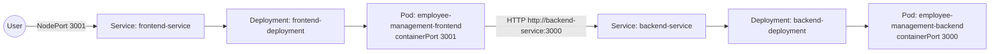
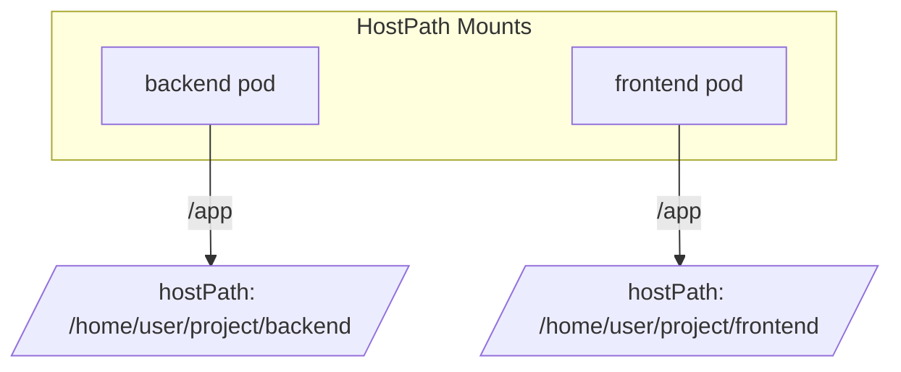

# Kubernetes Manifests (Developer Sandbox)

The `kubernetes/` directory packages a minimal set of manifests for running the Employee Management frontend and backend inside a Kubernetes cluster. They are tuned for iterative development (local paths, permissive settings).



## Files

| File | Purpose |
|------|---------|
| `backend-deployment.yaml` | Deploys one backend pod (`employee-management-backend:latest`) exposing container port **3000**, with a `hostPath` volume that mounts code from the worker node directory `/home/user/project/backend` into `/app`. |
| `backend-service.yaml` | ClusterIP service forwarding port **3000** to backend pods. No external exposure is provided. |
| `frontend-deployment.yaml` | Deploys one frontend pod (`employee-management-frontend:latest`) exposing container port **3001**, mounting `/home/user/project/frontend` into `/app` using `hostPath`. Sets `REACT_APP_BACKEND_URL=http://backend-service:3000`. |
| `frontend-service.yaml` | NodePort service exposing port **3001** (Node port assigned automatically) for browser access. |
| `configmap.yaml` | Stores `NODE_ENV=production` and `REACT_APP_BACKEND_URL=http://backend-service:3000`. Not currently referenced by the deployments. |



## Usage

1. **Prerequisites**
   - A Kubernetes cluster where you may mount host paths at `/home/user/project/...` (e.g., local Kind or Minikube with matching directories).
   - Docker images `employee-management-backend:latest` and `employee-management-frontend:latest` present on each node (or loaded into the cluster).

2. **Apply manifests**
   ```bash
   kubectl apply -f kubernetes/
   ```

3. **Access the UI**
   - Retrieve the NodePort assigned to `frontend-service`:
     ```bash
     kubectl get svc frontend-service
     ```
   - Open `http://<node-ip>:<node-port>` in a browser.

## Important Notes

- **Ports**: The manifests expose container ports `3000` (backend) and `3001` (frontend). Update them if you rebuild containers that listen on different ports (e.g., Spring Boot default `8080`).
- **Volumes**: HostPath volumes tie pods to the node's filesystem. Replace them with ConfigMaps, Secrets, or persistent volumes before deploying to shared clusters.
- **ConfigMap**: Although provided, the current deployments hardcode environment variables. Wire the ConfigMap via `envFrom` or `env` entries to adopt centralized configuration.
- **Replica count**: Both deployments default to a single replica. Increase `spec.replicas` for redundancy once images and storage are stateless.
- **Ingress**: No ingress controller configuration is included. Exposing the application publicly requires adding an Ingress resource or switching the frontend service to `LoadBalancer`.

> [!NOTE]
> These manifests are intended to be combined with [`aws/terraform`](../aws/README.md) for a complete production-ready deployment. The Terraform stack creates an EKS cluster, RDS instance, and ECR repositories. After pushing images to ECR, update the deployment manifests to reference the ECR image URIs and configure database connection parameters via environment variables or Kubernetes Secrets.