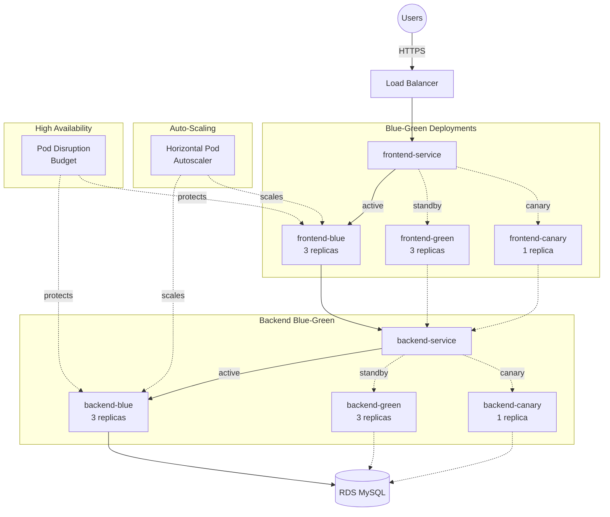

# Kubernetes Manifests - Production-Ready Deployment

The `kubernetes/` directory contains production-ready manifests for deploying the Employee Management System to Kubernetes with support for multiple deployment strategies including blue-green and canary deployments.



## Directory Structure

### Deployment Manifests

| File | Purpose |
|------|---------|
| `backend-deployment-blue.yaml` | Blue environment backend deployment (3 replicas, production-ready) |
| `backend-deployment-green.yaml` | Green environment backend deployment (3 replicas, production-ready) |
| `backend-deployment-canary.yaml` | Canary backend deployment (1 replica for testing) |
| `frontend-deployment-blue.yaml` | Blue environment frontend deployment (3 replicas) |
| `frontend-deployment-green.yaml` | Green environment frontend deployment (3 replicas) |
| `frontend-deployment-canary.yaml` | Canary frontend deployment (1 replica) |

### Service Definitions

| File | Purpose |
|------|---------|
| `backend-service-production.yaml` | Backend service routing (includes blue, green, canary selectors) |
| `frontend-service-production.yaml` | Frontend LoadBalancer service (includes all environment selectors) |

### Legacy Files (Development Only)

| File | Purpose |
|------|---------|
| `backend-deployment.yaml` | Legacy single deployment (for local development) |
| `backend-service.yaml` | Legacy ClusterIP service |
| `frontend-deployment.yaml` | Legacy single deployment (for local development) |
| `frontend-service.yaml` | Legacy NodePort service |
| `configmap.yaml` | Legacy ConfigMap (replaced by configmap-production.yaml) |

### Production Resources

| File | Purpose |
|------|---------|
| `configmap-production.yaml` | Production ConfigMaps for backend and frontend |
| `secrets-template.yaml` | Template for creating Kubernetes secrets |
| `rbac.yaml` | Service accounts, roles, and role bindings |
| `hpa.yaml` | Horizontal Pod Autoscalers for auto-scaling |
| `pdb.yaml` | Pod Disruption Budgets for high availability |
| `network-policy.yaml` | Network policies for pod-to-pod security |

### Documentation

| File | Purpose |
|------|---------|
| `DEPLOYMENT-GUIDE.md` | Comprehensive deployment guide with all strategies |
| `README.md` | This file - overview and quick start |

## Deployment Strategies

This deployment infrastructure supports three production-ready deployment strategies:

### 1. Rolling Deployment
- Gradual update with zero downtime
- Automatic health check verification
- Built-in rollback capability

### 2. Blue-Green Deployment
- Complete environment switch
- Instant rollback capability
- Zero-downtime deployments
- Ideal for major releases

### 3. Canary Deployment
- Gradual traffic shift (10% → 100%)
- Real user traffic validation
- Risk mitigation for high-impact changes
- Easy promotion or rollback

See **[DEPLOYMENT-GUIDE.md](./DEPLOYMENT-GUIDE.md)** for detailed instructions.

## Quick Start

### Prerequisites

- Kubernetes cluster (v1.27+) - AWS EKS recommended
- `kubectl` CLI configured
- Docker images in ECR
- Terraform for infrastructure provisioning

### Initial Setup

1. **Provision Infrastructure**
   ```bash
   cd aws/terraform
   terraform init
   terraform apply
   ```

2. **Configure kubectl**
   ```bash
   aws eks update-kubeconfig --region us-east-1 --name employee-management-eks
   ```

3. **Create Secrets**
   ```bash
   kubectl create secret generic backend-secrets \
     --from-literal=db-host=<RDS_ENDPOINT> \
     --from-literal=db-password=<PASSWORD>
   # ... add other required secrets
   ```

4. **Deploy Base Resources**
   ```bash
   cd kubernetes
   kubectl apply -f rbac.yaml
   kubectl apply -f configmap-production.yaml
   kubectl apply -f hpa.yaml
   kubectl apply -f pdb.yaml
   kubectl apply -f network-policy.yaml
   ```

### Deploy Using Blue-Green Strategy

```bash
# Deploy to blue environment
export ECR_REGISTRY=<your-ecr-url>
export IMAGE_TAG=v1.0.0

envsubst < backend-deployment-blue.yaml | kubectl apply -f -
envsubst < frontend-deployment-blue.yaml | kubectl apply -f -

# Apply services
kubectl apply -f backend-service-production.yaml
kubectl apply -f frontend-service-production.yaml

# Verify deployment
kubectl get pods -l version=blue
```

### Or Use Deployment Scripts

```bash
# Blue-Green deployment
./scripts/deploy-blue-green.sh green v1.2.3
./scripts/switch-blue-green.sh green

# Canary deployment
./scripts/deploy-canary.sh v1.2.3
./scripts/promote-canary.sh v1.2.3

# Rollback
./scripts/rollback-deployment.sh all
```

### Access the Application

```bash
# Get Load Balancer URL
kubectl get svc frontend-service

# Output:
# NAME               TYPE           EXTERNAL-IP                          PORT(S)
# frontend-service   LoadBalancer   a1b2c3...elb.amazonaws.com           80:32000/TCP
```

Navigate to the EXTERNAL-IP in your browser.

## Production Features

### High Availability
- **Multiple Replicas**: 3 replicas per deployment (blue/green)
- **Pod Disruption Budgets**: Ensures minimum availability during updates
- **Anti-Affinity Rules**: Spreads pods across nodes
- **Multi-AZ Deployment**: Nodes across multiple availability zones

### Auto-Scaling
- **Horizontal Pod Autoscaler**: Scales based on CPU/memory usage
- **Cluster Autoscaler**: Adds nodes when needed (via Terraform)
- **Resource Limits**: Prevents resource exhaustion

### Security
- **Network Policies**: Restrict pod-to-pod communication
- **RBAC**: Least-privilege service accounts
- **Pod Security**: Non-root containers, read-only filesystem
- **Secrets Management**: Integration with AWS Secrets Manager
- **KMS Encryption**: Secrets encrypted at rest

### Observability
- **Health Checks**: Liveness, readiness, and startup probes
- **Metrics**: Prometheus annotations for scraping
- **CloudWatch Integration**: Logs and metrics to CloudWatch
- **Structured Logging**: JSON logs for better parsing

### Deployment Safety
- **Rolling Updates**: Zero-downtime updates
- **Blue-Green**: Instant rollback capability
- **Canary**: Gradual risk mitigation
- **Automatic Rollback**: Failed deployments rollback automatically

## CI/CD Integration

The infrastructure integrates with Jenkins for automated deployments:

1. **Build & Test**: Runs tests and builds Docker images
2. **Security Scanning**: Scans images for vulnerabilities
3. **Deploy**: Supports rolling, blue-green, and canary strategies
4. **Verify**: Runs smoke tests and health checks
5. **Monitor**: Watches deployment status
6. **Rollback**: Automatically rolls back on failure

See `Jenkinsfile` in the project root for the complete pipeline.

## Terraform Integration

The Kubernetes manifests work seamlessly with the Terraform-provisioned infrastructure:

- **EKS Cluster**: Managed Kubernetes cluster
- **VPC & Networking**: Multi-AZ VPC with public/private subnets
- **RDS Database**: Multi-AZ MySQL database
- **ECR Repositories**: Container image registry
- **IAM Roles**: IRSA roles for service accounts
- **KMS Keys**: Encryption for secrets
- **CloudWatch**: Logging and monitoring

See [`aws/terraform/`](../aws/terraform/) for infrastructure as code.

## Additional Documentation

- **[DEPLOYMENT-GUIDE.md](./DEPLOYMENT-GUIDE.md)** - Comprehensive deployment guide
- **[../aws/terraform/](../aws/terraform/)** - Infrastructure provisioning
- **[../Jenkinsfile](../Jenkinsfile)** - CI/CD pipeline
- **[Scripts](../scripts/)** - Deployment helper scripts

## Support

For issues or questions:
1. Check the [DEPLOYMENT-GUIDE.md](./DEPLOYMENT-GUIDE.md) troubleshooting section
2. Review Kubernetes events: `kubectl get events --sort-by='.lastTimestamp'`
3. Check pod logs: `kubectl logs -l app=backend`
4. Verify resource status: `kubectl get all -l environment=production`