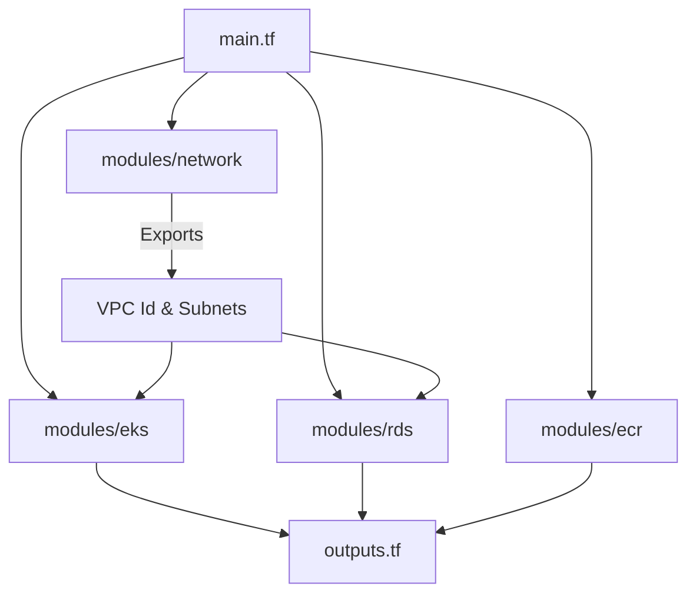
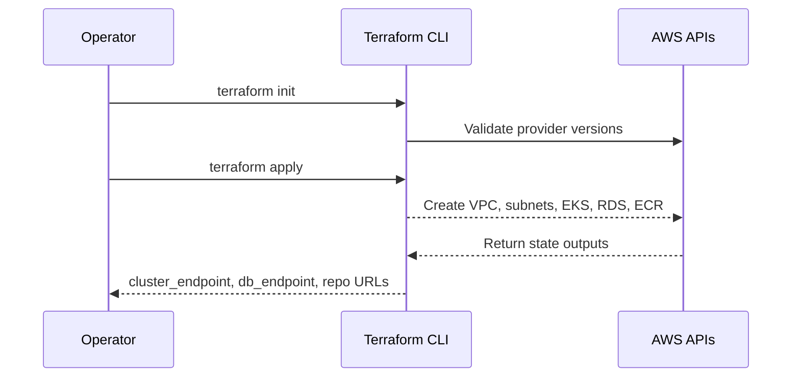

# Terraform Stack

This directory contains the original Terraform configuration that ships with the repository. It uses opinionated modules housed in `modules/` to stand up an AWS footprint composed of networking, EKS, RDS MySQL, and ECR registries. Unlike the production-focused stack under [`aws/terraform`](../aws), this configuration keeps everything in a single workspace and does **not** provision supporting services such as Secrets Manager or hardened security groups. Use it for experimentation or sandbox clusters; rely on [`aws/terraform`](../aws) for production workloads.



## Requirements

- Terraform ≥ 1.0
- AWS credentials with permissions to manage VPC, EKS, EC2, IAM, RDS, and ECR resources
- kubectl for post-provisioning EKS interaction
- Docker (or similar) to build the frontend/backend container images that will be pushed to the generated ECR repositories

## Files at a Glance

- `provider.tf` & `variables.tf`: define providers (`aws`, `kubernetes`) and configurable parameters (region, VPC CIDRs, EKS node sizing, RDS settings, credentials).
- `main.tf`: orchestrates the four local modules (`network`, `eks`, `rds`, `ecr`).
- `outputs.tf`: exposes cluster endpoints, database hostnames, and ECR repository URLs once the plan is applied.
- `modules/network`: rolls a VPC, public/private subnets, internet gateway, and public route tables.
- `modules/eks`: wraps the community EKS module v18.0.0 to provision an EKS control plane plus a managed node group.
- `modules/rds`: provisions a MySQL instance with a wide-open security group (`0.0.0.0/0` ingress on port 3306). Harden this before using in shared environments.
- `modules/ecr`: creates dedicated ECR repositories for the backend and frontend images.



## Usage

1. **Configure variables**
   - Create a `terraform.tfvars` file (or use environment variables) to set required values such as `db_password`.
   - Review defaults in `variables.tf` and adjust CIDRs or node sizes as needed.

2. **Initialize & deploy**
   ```bash
   terraform init
   terraform plan -out plan.tfplan
   terraform apply plan.tfplan
   ```

3. **Post-apply steps**
   - Update local kubeconfig using the `cluster_endpoint` and certificate outputs, or directly via the AWS CLI:
     ```bash
     aws eks update-kubeconfig --name <cluster_name> --region <region>
     ```
   - Build and push container images to the emitted ECR repositories (`backend_ecr_repository`, `frontend_ecr_repository`).
   - Patch the Kubernetes manifests under `kubernetes/` to reference the new image URIs and database connection parameters.

## Important Caveats

- **Security**: The RDS security group allows ingress from the public internet. Replace it with restrictive CIDR blocks or security-group-to-security-group rules prior to exposing workloads.
- **Secrets**: Database credentials are injected via Terraform variables and end up in state. There is no Secrets Manager integration; handle storage of the Terraform state securely.
- **Kubernetes Provider**: `provider.tf` configures the Kubernetes provider to talk to the EKS cluster using outputs from the module. Terraform will fail unless the control plane is reachable from the machine applying the plan.
- **MongoDB**: The stack makes no attempt to provision MongoDB even though the Spring Boot application can be configured to use it.

## Migrating to the `aws/terraform` Stack

If you need a production-ready footprint with Secrets Manager, stronger security defaults, and richer documentation, prefer the new modules in `aws/terraform`. Both stacks can coexist—just ensure you keep state files separate (different backend or working directory) and dismantle one before applying the other inside the same AWS account to avoid naming collisions.

---

Always inspect the `terraform plan` output and adapt CIDRs, instance classes, and security rules to your organization’s standards before running this configuration against a real AWS environment. Our configuration/setup may not apply to your specific use case...
